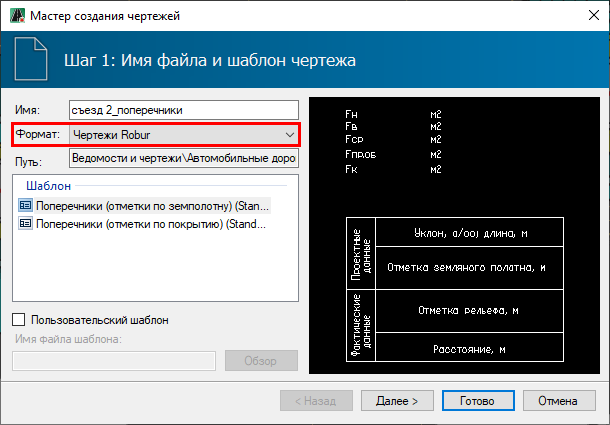
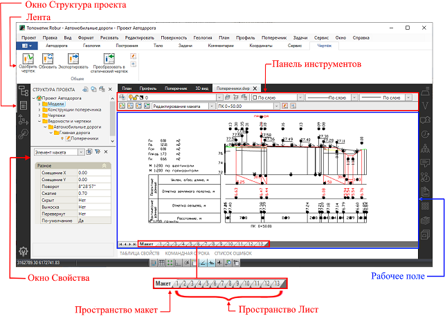
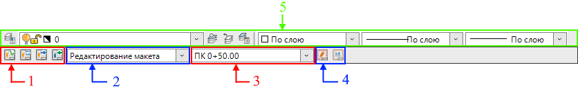
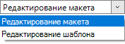
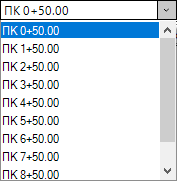

# Рабочее окно динамического чертежа

Для начала работы с динамическим чертежом, он должен быть создан в формате **Чертежи Robur**. Для этого:

1. Выберите меню **Проект – Создать чертеж – «*Наименование чертежа*»**, например **Поперечные профили**.

   

   В зависимости от решаемой задачи, функции для создания других чертежей могут находиться в других разделах меню программы, что указано в соответствующих разделах документации.

   

2. Откроется окно **Мастер создания чертежей**, в котором выберите формат **Чертежи Robur** и нажмите **Готово**:

   

   

   Для создания чертежа поперечного профиля необходимо [Пометить](../../../ru/rb_survey/alg/track_crossection/mark_diameters.md) хотя бы один поперечник.

   

   Динамический чертеж автоматически откроется.

Окно динамического чертежа состоит из:

* **Лента Чертёж.**
* **Окно Структура проекта.**
* **Окно Свойства.**
* **Рабочее поле.**
* **Пространство Макет**.
* **Пространство Лист**.
* **Панель инструментов**.

#|
|| {.cell-align-center}||
||**Примечание.** В динамических чертежах *Продольного профиля, Профиля сети, Колонок выработок и др*. панель инструментов может содержать другие опции.||
|#

* На ленте представлен функционал для взаимодействия с динамическими данными чертежа.
* В окне **Свойства** отображаются параметры выбранного элемента макета или тега.
* В пространстве **Лист** чертежи отображаются в том виде, в котором пойдут на печать. Пространство **Лист** нужно для того чтобы например, дорисовать условные обозначения или вставить печати в чертеж.
* В пространстве **Макет** представлен текущий макет динамического чертежа, в котором производится работа непосредственно с самим чертежом. Работа с динамическим чертежом ведется в двух режимах **Редактирование макета** и **Редактирование шаблона**.
* Панель инструментов **Макета** динамического чертежа:

#|
|| {.cell-align-center}||
||**Примечание.** В динамических чертежах продольного профиля, профиля сети, колонок выработок и др. панель инструментов может содержать другие опции.||
|#

* 1 - Общие функции для взаимодействия с динамическими данными чертежа.
* 2 - Селектор переключения режимов в **Макете**:

   

* 3 - Селектор выбора текущего чертежа по пикетажному значению:

   

   

   В динамических чертежах *Продольного профиля, Профиля сети, Колонок выработок и др*. данный селектор может отвечать за другой вариант навигации.

   

* 4 - Функции для изменения параметров макета и сохранения пользовательского шаблона макета.
* 5 - Панель инструментов для настройки отображения данных чертежа (работа со слоями, настройка типа и толщины линий, настройка цвета).