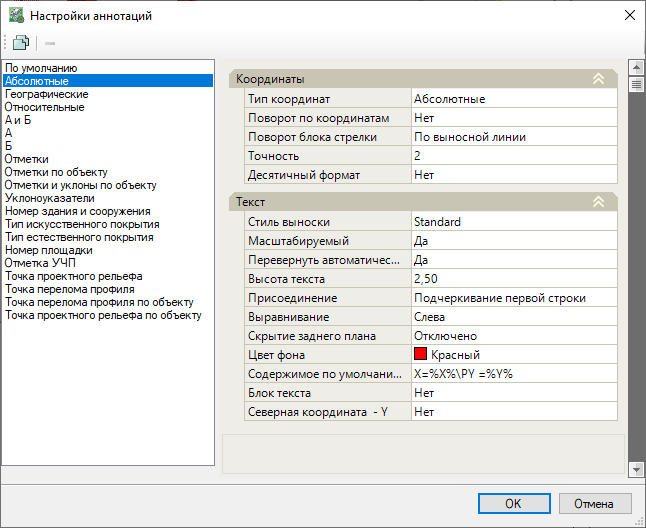
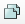

# Параметры аннотаций

Данные настройки задают параметры и свойства **Стилей аннотаций**, которые влияют на отображение Подписей аннотаций.

Для этого выберите:

1. Выберите меню **Задачи - Аннотации - Параметры аннотаций**;

2. Откроется окно **Настройки аннотаций**. По умолчанию в программу добавлены системные Стили аннотаций:

В верхнем поле слева находятся пиктограммы настроек данного окна:

* Пиктограмма  дублирует выбранный стиль и создает на основе него пользовательский стиль.
* Пиктограмма  удаляет выбранный стиль, при этом удаление системного стиля заблокировано для пользователя.

В поле справа задаются **Свойства** для выбранного стиля аннотаций:

## Координаты

В разделе **Координаты** настраивается Тип координат, Поворот блока стрелки аннотации, Точность, Десятичный формат (Да/Нет):

* **Тип координат** – задается тип координат, по которому программа проставить значения: по **Абсолютным координатам**, **Относительным координатам**, **Географическим координатам**, **Координатам вида "А" и "Б"**.



 Предварительно, для отображения значений по **Относительным координатам** и **Координатам вида "А" и "Б"** необходимо [Настроить ССК](setting_up_SSC.md). Для вывода значений по **Географическим координатам** необходимо предварительно [Назначить СК](../../../ru/commons_tasks/coordinate_systems/coordinate_systems.md).



* **Поворот по координатам** – данный параметр позволяет настроить поворот выноски. При выборе значения **Да**, программа развернет подписи аннотаций по заданному **Типу координат**. При выборе значения **Нет**, подписи будут повернуты согласно направлению структурной линии, либо согласно направлению **Абсолютных координат**.

* **Поворот блока стрелки** – данный параметр позволяет настроить поворот блока стрелки по заданной **Системе координат**, **По выносной линии** или **Пользовательский**.

* **Точность** – в данном поле задается максимальное количество знаков после запятой в значениях аннотации.

* **Десятичный формат** – данный параметр позволяет выбрать обозначение для выражения **Географических координат** широты и долготы в виде десятичных долей градуса.

## Текст

В разделе **Текст** задаются настройки Стиля текста, Высота текста, Масштаб текста, Содержимое подписи и другие параметры:

* **Стиль выноски** – данный параметр позволяет выбрать Текстовый стиль аннотации.

* **Масштабируемый** – данный параметр позволяет настроить автоматическое изменение подписи аннотации при изменении масштаба изображения модели на экране.

* **Перевернуть автоматически** – при выборе значения **Да**, полка выноски ориентируется автоматически в зависимости от положения текста.

* **Высота текста** – данный параметр задает высоту букв подписи аннотации, значение может быть введено вручную в миллиметрах.

* **Присоединение** – данный параметр позволяет выбрать вид присоединения выносной линии к подписи аннотации.

* **Выравнивание** – данный параметр позволяет выбрать привязку текста подписи (**Слева/По центру/Справа**).

* **Скрытие заднего плана** – из списка можно выбрать заливку заднего фона текста. При выборе значения **Использовать цвет заливки** цвет фона подписи примет цвет согласно выбранному цвету в поле **Цвет фона**. При выборе значения **Цвет фона чертежа** цвет фона подписи будет принят согласно цвету фона рабочего поля.

* **Цвет фона** – в данном выпадающем списке выбирается цвет фона подписи аннотации.

* **Содержимое по умолчанию** – содержимое данного поля определяет, какая информация в результате будет отображена в подписи аннотации. Данное текстовое поле может содержать текст и стандартные Тэги:

| **Теги** |  |
| --- | --- |
| Наименование Свойства элемента | Название идентификатора (Тэга) |
| Проектная отметка | %Z% |
| Разница отметок (Рабочая отметка) | %DZ% |
| Отметка черной земли | %EZ% |
| Координата X | %X% |
| Координата Y | %Y% |
| Номер точки | %NUMBER% или %NUM% |
| Код точки | %CODE% |
| Описание точки | %DESC% |
| Уклон | %GRADE%, %RGRADE% |
| Расстояние | %DIST% |
| Цвет (цифру возможно задать от 1 до 255) | \C1; |
| Перенос текста | \P |

* **Блок текста** – в данном выпадающем списке можно выбрать вид блока текста, а именно **Окружность**, **Квадрат** или **Пользовательская**, выбрав пользовательский чертеж с блоком.

* **Северная координата - Y** – данный параметр позволяет задать в качестве Северной координаты - ось Y, координаты в подписи аннотации поменяются местами.

## Геометрия

В разделе **Геометрия** задаются настройки выносной линии подписи: Стрелка, Размер стрелки, Угол выносной линии и другие параметры.

* **Стрелка** – в данном выпадающем списке можно выбрать вид стрелки выносной линии подписи.

* **Размер стрелки** – данный параметр задает размер стрелки, значение может быть введено вручную в миллиметрах.

* **Угол выносной линии** – данный параметр позволяет автоматически задать угол выносной линии подписи **при вводе выноски по 1 точке**.

* **Длина выносной линии** – данный параметр задает длину выносной линии, значение может быть введено вручную в миллиметрах.

* **Поворот выносной линии по координатам** – данный параметр позволяет настроить поворот выносной линии аннотации. При выборе значения **Да**, программа развернет выносные линии аннотаций по заданным **Настройкам ССК**.

* **Рисовать выносную линию** – данный параметр позволяет включить/отключить видимость выносной линии.

## Прочее

В разделе **Прочее** для стиля аннотации можно задать **Слой** подписи аннотации.

