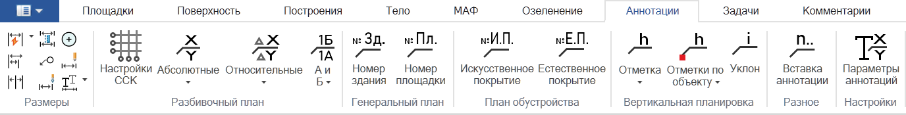
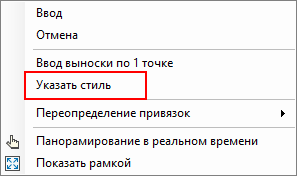
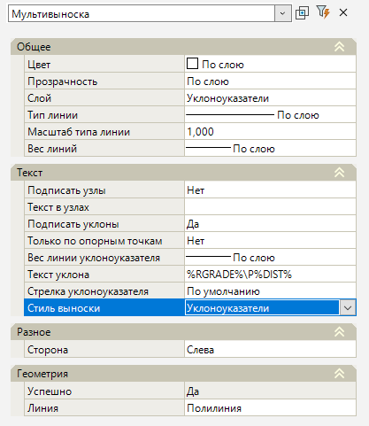

# Аннотации

Для контроля проектных и фактических отметок, уклонов и других характеристик можно использовать функционал **Аннотаций**, который возможно добавить по любой точке или структурной линии (по объекту). Все аннотации являются динамическими.

Для этого выберите:

1. Выберите меню **Задачи - Аннотации**, пользователь может проставить подписи со следующей информацией:

* Данные по **Абсолютным координатам**, **Относительным координатам**, **Географическим координатам**, **Координатам вида "А" и "Б"** отображаются в аннотациях согласно данным по тегам **%X%** и **%Y%**. Более подробно настройки аннотаций описаны в разделе [[genplan:genplan:annotations:annotation_settings:start|Параметры аннотаций]].



 Предварительно, чтобы на ленте появились дополнительные иконки подписей **Относительных координат** и **Координат вида "А" и "Б"** необходимо [Настроить ССК](setting_up_SSC.md). Для вывода значений по **Географическим координатам** необходимо предварительно [Назначить СК](../../../ru/commons_tasks/coordinate_systems/coordinate_systems.md).



* Подписи **Номера здания** и **Номера площадки**. Аннотации данного типа берут значения с участка поверхности и заданных ему семантических свойств **Позиция (номер на плане)** (тег **%Position%**) и **Номер площадки** (тег **%Site_number%**). Более подробно настройки аннотаций описаны в разделе [[genplan:genplan:annotations:annotation_settings:start|Параметры аннотаций]].

* Подписи по Плану благоустройства - **Искусственное покрытие** , **Естественное покрытие**. Аннотации данного типа берут значения с участка поверхности и заданного ему семантического свойства **Позиция (Тип покрытия в проекте)** (тег **%Position%**). Более подробно настройки аннотаций описаны в разделе [[genplan:genplan:annotations:annotation_settings:start|Параметры аннотаций]].

* Различные отметки по Вертикальной планировки (**Отметка УЧП**, **Отметка проектного рельефа**, **Отметка перелома профиля** и т.д.) и **Уклоны** по выстроенной полилинии. Значения отметок и уклонов выводятся согласно тегам **%Z%, %EZ%, %RGRADE%, %DIST%** и другим, более подробно настройки аннотаций и список тегов представлены в разделе [[genplan:genplan:annotations:annotation_settings:start|Параметры аннотаций]].

* При выборе Разное - **Вставка аннотации** можно проставить любую подпись аннотации, в том числе пользовательскую. Для этого при вставке аннотации нажмите ПКМ и из появившегося контекстного меню выберите **Указать стиль**. Программа откроет окно [[genplan:genplan:annotations:annotation_settings:start|Настроек параметров аннотаций]] для выбора необходимого стиля.

2. Укажите в окне План местоположение точки, либо выберите объект (структурную линию).

3. Таким образом, на План будут добавлены **Мультивыноски** с соответствующей информацией.

Отредактировать **Мультивыноски** можно через **Свойства**, выбрав **Мультивыноску** в окне План:

Остальные параметры отображения аннотаций назначаются через выбранный **Стиль выноски**, который можно отредактировать через окно редактирования Параметров аннотаций.

