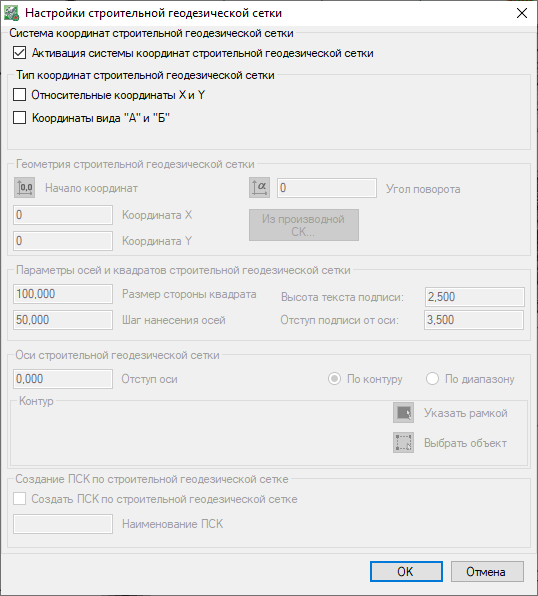
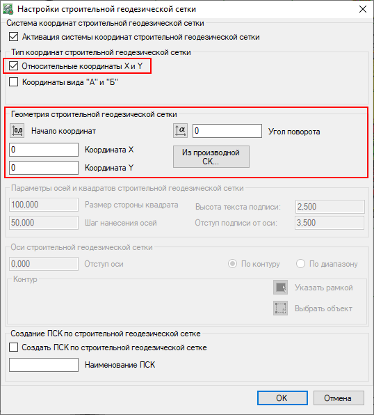
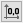
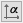
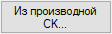
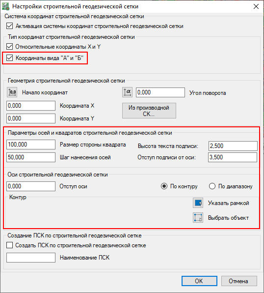
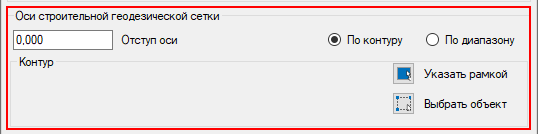
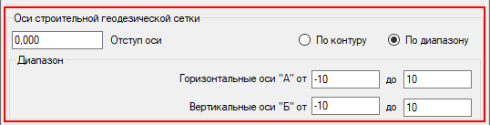
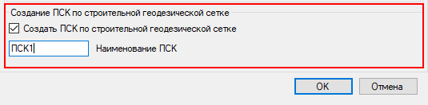

# Настройки ССК

Данный функционал позволяет настроить параметры **Относительной системы координат**, а также задать параметры и отобразить **Строительную геодезическую сетку.**

Активация данного функционала позволит расставлять аннотации такого типа как **Относительные координаты** и **Координаты вида А и Б**, а также автоматически разворачивать аннотации по активированной **Относительной системе координат**.

Для активации окна **Настройки строительной геодезической сетки**:

1. Выберите меню **Задачи - Аннотации - Разбивочный план - Настройки ССК**;

2. В открывшемся окне нажмите на галочку для **Активацию системы координат строительной геодезической сетки**.

3. Программа предложит выбрать Тип координат строительной геодезической сетки. Пользователь может выбрать первый вариант - **Относительные координаты X и Y**, а также одновременно второй вариант - **Координаты вида "А" и "Б"**.

4. При активации Типа координат **Относительные координаты X и Y** появится возможность настроить **Геометрию строительной геодезической сети**.

* Нажав пиктограмму  , можно в окне План указать начало относительных координат. Также данные значения можно ввести вручную в соответствующие области ввода.
* Нажав пиктограмму , можно в окне План задать угол поворота осей относительных координат относительно оси X. Также значение угла можно ввести вручную в соответствующую область ввода.
* Нажав кнопку , можно назначить производную [Систему координат](../../commons_tasks/coordinate_systems/coordinate_systems.md), принцип работы которой был описан ранее.

5. При активации Типа координат **Координаты вида "А" и "Б"** появится возможность настроить **Параметры осей и квадратов строительной геодезической сетки**.

* Через задание значения **Размера стороны квадрата** и значения **Шага нанесения осей** возможно детально настроить параметры геодезической сетки.
* Через **Высоту текста подписи**, **Отступ подписи от оси** и **Отступ оси** задаются настройки начертания текста (подписей) геодезической сетки.
* Возможно выбрать один из вариантов создания осей геодезической сетки - **По контуру** или **По диапазону**:

Выбирая **По контуру** программа позволяет в окне План указать внешний контур, который будет являться границей для осей геодезической сетки.

**По диапазону** можно указать количество горизонтальных и вертикальных осей, которые будут строится от ранее указанного начала относительных координат.

5. Все настройки строительной геодезической сетки можно сохранить через раздел **Создание ПСК по строительной геодезической сетке**. Для этого нажмите галочку в окне создания и впишите **Наименование ПСК**:

При сохранении созданная ПСК будет сохранена в [Библиотеку СК](../../commons_tasks/coordinate_systems/coordinate_systems.md) - **Системы координат - Системы координат проекта**. При дальнейшей работе пользователь может назначить ранее созданную и настроенную ПСК.



 Раздел **Создание ПСК по строительной геодезической сетке** в окне **Настройки ССК** будет активен в том случае, если ранее в модели была [назначена Система координат](../../commons_tasks/coordinate_systems/coordinate_systems.md).



5. Для завершении **Настроек ССК** нажмите **ОК**.



 Для управления видимостью геодезической сетки в нижней части рабочего окна План на **Панели управления**, имеется соответствующая кнопка с иконкой .



