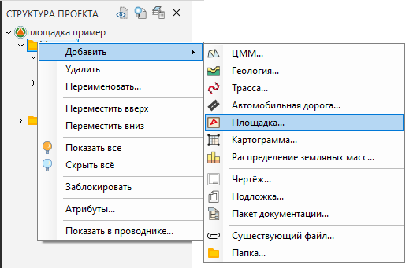
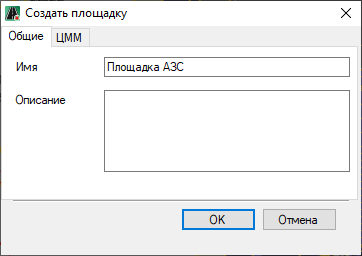
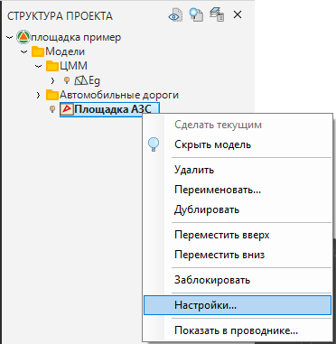
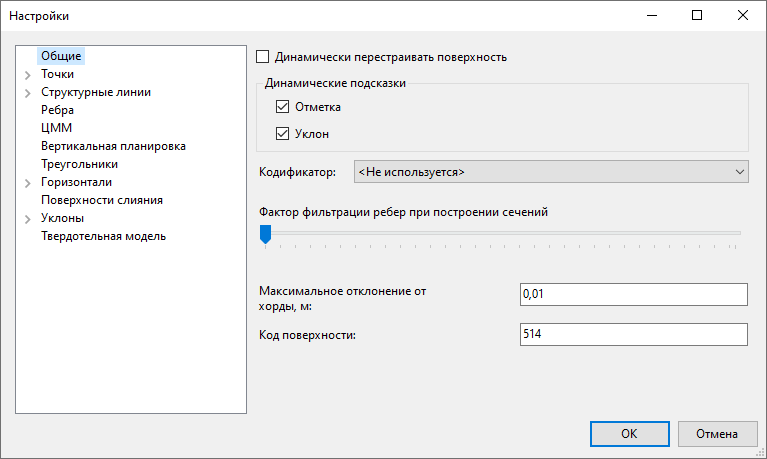
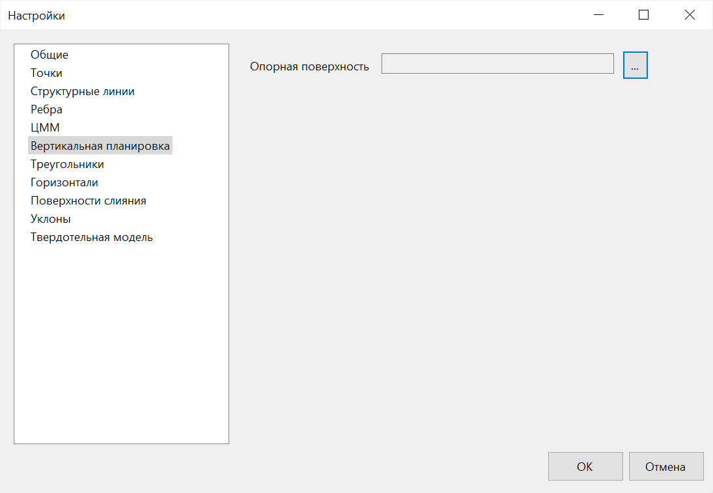
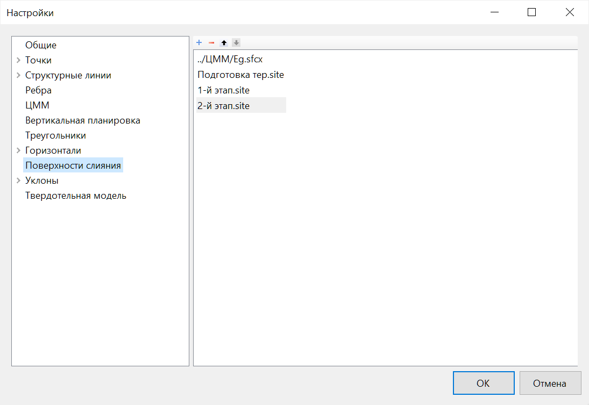

# Создание и Настройки модели Площадка

Для создания объектов генплана и иных площадных объектов в программе существует специальная модель - **Площадка**. В качестве исходных данных для проектирования необходима поверхность существующей земли. Также в случае примыкания проектируемой площадки к линейным объектам, они должны быть учтены в настройках модели **Площадки**.

Для того чтобы создать новую модель **Площадка** необходимо сделать следующее:

1. В окне Структура проекта нажмите ПКМ по папке, в которой необходимо создать новую модель, и выберите из появившегося контекстного меню пункт **Добавить – Площадка**:

2. В появившемся окне во вкладке **Общее** задайте наименование и описание создаваемой модели площадки. Затем во вкладке **ЦММ** выберите модель поверхности земли и в случае необходимости дополнительные модели, к которым будет примыкать площадка. Нажмите **ОК**:

Созданная модель автоматически стала текущей, а ее наименование отобразилось в структуре проекта.

## Настройка модели Площадка

Для задания созданной модели необходимых настроек в окне **Структура проекта** нажмите ПКМ по ее наименованию и выберите из появившегося меню пункт **Настройки**:

Откроется окно настроек текущей поверхности:

На вкладках данного окна задаются основные настройки отображения элементов текущей поверхности (стиль отображения точек, шаг горизонталей, тип освещения поверхности и т.п.).



 Большинство данных настроек аналогичны настройкам модели ЦММ и подробно были описаны ранее (см. [Том 3 Работа с ЦММ, Глава 2 Создание и редактирование поверхности](../rb_survey/dtm/sfc/edit/setting_display_elements_surface.md))



* Вкладка **Общее**

Максимальное отклонение от хорды - данное значение учитывается в функции [Создать поверхность из примитивов](../genplan/utilities/creating_surface_from_primitives.md) и влияет на "точность" построения структурных линий и полигонов в случае когда базовые примитивы имеют дуги и радиусы.      

* Вкладка **ЦММ** 

На вкладке **ЦММ** отметьте в списке те поверхности, которые будут считаться “черной землей” для проектируемой площадки и нажмите **ОК**.



  - Назначение черной поверхности земли необходимо для многих функций моделирования площадки. К примеру, она используется для построения откосов с границы площадки, определения ее оптимальной отметки исходя из баланса объемов земляных масс и т.п.
  - Черных поверхностей может быть выбрано несколько. К примеру, при примыкании площадки к проектируемой дороге, для более точного подсчета объемов работ, проектная поверхность дороги также может быть назначена в виде черной земли для моделируемой площадки.



* Вкладка **Вертикальная планировка**

На данной вкладке задается **Опорная поверхность**. В основном, в качестве **Опорной поверхности** выступает модель **Вертикальной планировки**, на которую осуществляется проецирование всех объектов генерального плана из модели **Горизонтальная планировка**. 



Описание функции, которая осуществляет проецирование на Опорную поверхность приведено [в данном разделе](../genplan/utilities/project_onto_the_support_surface.md).

 

* Вкладка **Поверхности слияния** 

На данной вкладке добавляются модели, которые будут участвовать в [Построении поверхности слияния](../genplan/utilities/create_merge_surface.md). Очередность слияния происходит по списку заданных моделей сверху-вниз. 

