# Создание ведомостей

По данным модели Площадка могут быть сформированы следующие основные выходные ведомости:

* **Ведомость площадей и длин элементов**;
* **Ведомость площадей (расширенная)**;
* **Ведомость длин (расширенная)**;
* **Ведомость объёмов**.

## Ведомость площадей и длин элементов

Для формирования ведомости площадей и длин элементов:

1. Выберите элемент меню **Площадки** - **Создать ведомость** - **Ведомости площадей и длин элементов**;

2. Откроется стандартный мастер создания ведомостей:

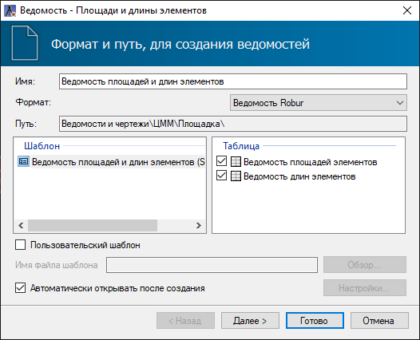

* **Имя** - в данном поле отображается наименование создаваемого файла ведомости. Данное поле редактируемое;

* **Формат** - в данном поле выбирается формат ведомости, в зависимости от редактора, в котором она будет открыта. По умолчанию ведомость представлена в формате **Robur**;

* В поле **Шаблон** представлен стандартный шаблон ведомости, согласно которому будет формироваться ведомость;

* В поле **Таблица** указываются формируемые разделы ведомости;

* Опция **Автоматически открывать после создания** позволяет автоматически открыть ведомость после ее создания.



При необходимости использования пользовательского шаблона установите опцию **Пользовательский шаблон** и выберите соответствующий файл с помощью кнопки **Обзор**. Механизмы настройки индивидуальных шаблонов ведомостей описаны в [Приложение Г. Редактирование динамических выходных ведомостей.](../doc/dynamic_vedomosti/edit_vedomosti_and_pattern.md)



При выборе формата **Ведомость Robur** нажмите **Далее** для дальнейших настроек.

3. На следующей вкладке необходимо последовательно указать диапазон кодов линейных/площадных элементов, по которым следует сформировать выбранную ведомость, нажмите **Далее**:

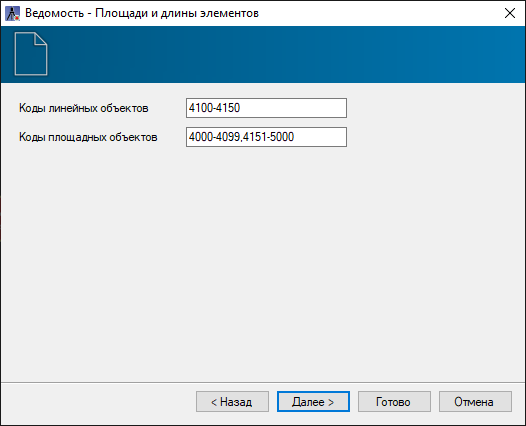

4. На вкладке **Шаблон листа** необходимо задать форматы листов и положение таблицы ведомости относительно границ листа, затем нажмите кнопку **Далее**:

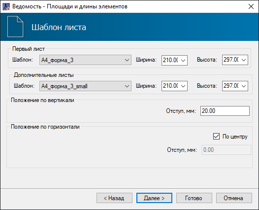



Если шаблон листа выбран **По умолчанию**, программа автоматически подберет формат листа по размеру ведомости.



5. На вкладке **Настройки шаблона листа** необходимо заполнить штамп ведомости:

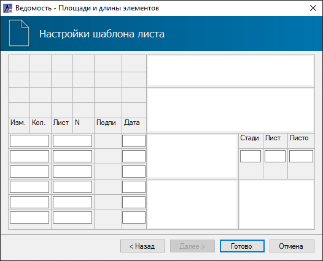

6. Задайте все необходимые настройки формирования ведомости и нажмите кнопку **Готово**. В результате в структуре проекта отобразится папка **Ведомости и чертежи**, в которой будет сформирована ведомость, и, в зависимости от ее формата, автоматически открыта в соответствующем редакторе.

## Ведомость площадей/длин (расширенная)

Расширенные ведомости в своей основе имеют общий конструктор по созданию классификации по объектам, различным параметрам, категориям и подкатегориям.

* **Ведомость площадей (расширенная)** создается по площадным объектам, которые в свою очередь назначаются на участок поверхности, как семантический код (объект).
* **Ведомость длин (расширенная)** создается по линейным объектам, которые в свою очередь назначаются на структурную линию, как семантический код (объект).

Семантический код (объект) может иметь свои атрибутивные данные, на которые назначаются соответствующие теги. Атрибутивные данные могут иметь, как линейную структуру, так и древовидную структуру (джамперы). Конструктор по созданию ведомостей позволяет формировать ведомости по тегам, то есть вне зависимости от положения атрибутивных данных в структуре (линейной/древовидной) семантического кода.



Работа с [Библиотекой семантических объектов](../annex/library_semantics/semantics.md) и атрибутивными данными представлена в соответствующем разделе.



Для создания расширенной ведомости:

1. Выберите меню **Площадки** - **Создать ведомость** - **Ведомости площадей/длин (расширенная)**;

2. Курсор примет форму прицела, укажите ЛКМ в окне План **ограничивающий контур** (структурную линию), либо выберите параметр **По всем объектам**, в этом случае все видимые в проекте объекты (площадные/линейные) в окне План будут учитываться в ведомости.

2. Откроется окно мастера формирования ведомостей. На вкладке **Формат и путь, для создания ведомостей** выберите необходимые настройки:

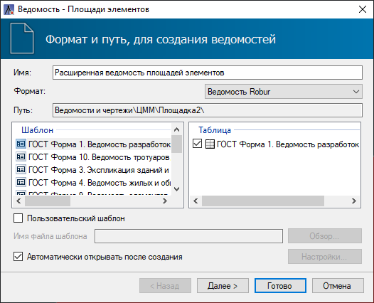

* **Имя** - в данном поле отображается наименование создаваемого файла ведомости. Данное поле редактируемое;

* **Формат** - в данном поле выбирается формат ведомости, в зависимости от редактора, в котором она будет открыта. По умолчанию ведомость представлена в формате **Robur**;

* В поле **Шаблон** представлены системные шаблоны ведомостей, согласно которому будут заданы первоочередные параметры, такие как шрифт, размер и т.д.;

* В поле **Таблица** указываются формируемые разделы ведомости;

* Опция **Автоматически открывать после создания** позволяет автоматически открыть ведомость после ее создания.



При необходимости использования пользовательского шаблона установите опцию **Пользовательский шаблон** и выберите соответствующий файл с помощью кнопки **Обзор**. Механизмы настройки индивидуальных шаблонов ведомостей описаны в [Приложение Г. Редактирование динамических выходных ведомостей.](../doc/dynamic_vedomosti/edit_vedomosti_and_pattern.md)



При выборе формата **Ведомость Robur** нажмите **Далее** для дальнейших настроек.

3. Следующая вкладка **Конфигурация** будет регламентировать дальнейшую настройку "диалога" создания ведомости, то есть все системные **Конфигурации** уже имеют свои настроенные параметры и категории согласно ГОСТу 21.508-2020, поэтому после выбора **Конфигурации** можно нажать кнопку **Готово**.

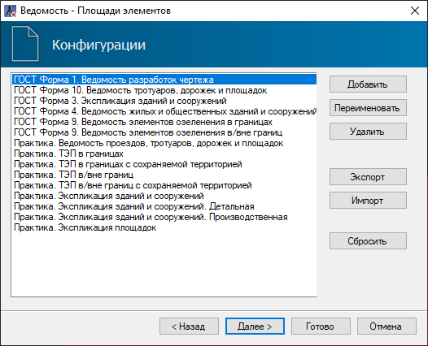

Также в список системных **Конфигураций** входят наиболее применимые на практике шаблоны с названием **Практика**.

* **Добавить, Переименовать, Удалить** - данные параметры позволяют создать новую Конфигурацию, переименовать или удалить системную Конфигурацию при необходимости;

* **Экспорт, Импорт** - данные параметры позволяют экспортировать или импортировать Конфигурацию;

* **Сбросить** - данный параметр позволяет обновить вкладку Конфигурации до первоначального состояния, то есть сбросить вышеперечисленные настройки.

При необходимости редактирования "диалога" системной **Конфигурации** или настройке "диалога" новой **Конфигурации** нажмите кнопку **Далее**.

4. На следующей вкладке необходимо выбрать модели, по элементам которых будет создаваться ведомость. Для этого выберите один из параметров: **Активная, Все, Выбранные**, нажмите **Далее**:

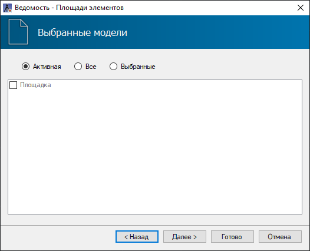

5. На вкладке **Параметры** находятся дополнительные настройки, которые отвечают за сортировку данных в ведомости: распределение значений, порядок строк, исключение различного рода объектов и т.д.

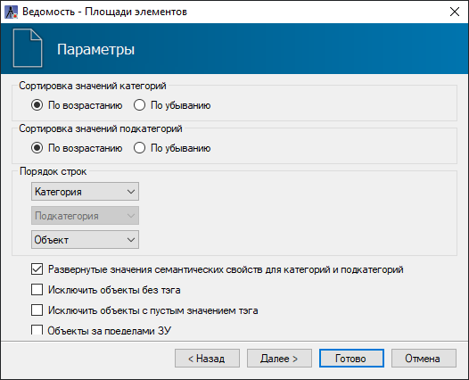

6. На вкладке **Семантические коды и категории** можно задать Коды объектов и первоочередно разбить объекты по категориям с помощью Джамперов, Значений джамперов и их Свойств.

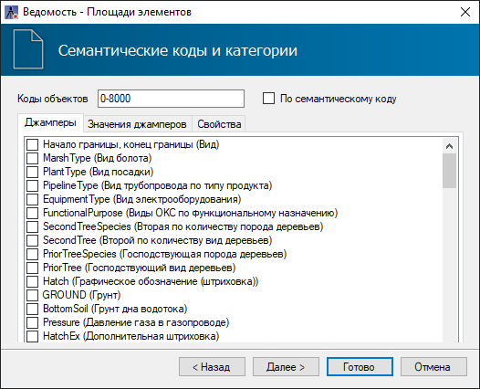

7. На вкладке **Подкатегории** можно разложить объекты во второй раз.

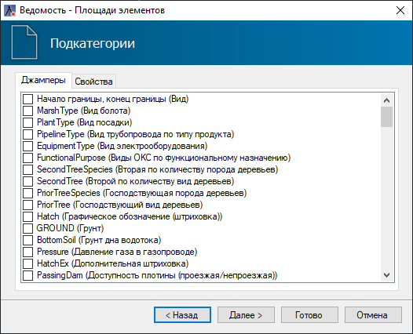

8. На вкладке **Критерии сортировки** есть возможность рассортировать объектные данные внутри создаваемой таблицы ведомости. Для добавления нового критерия сортировки необходимо нажать на кнопку 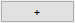 .

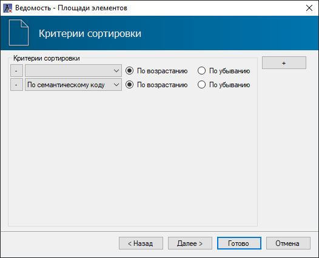

9. На вкладке **Шаблон листа** необходимо задать форматы листов и положение таблицы ведомости относительно границ листа, затем нажмите кнопку **Далее**:

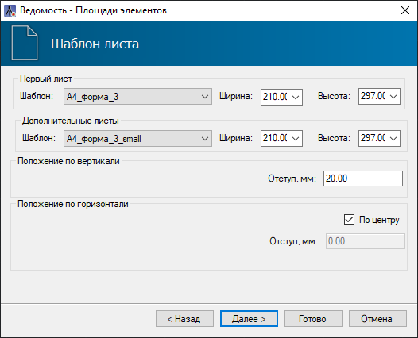



Если шаблон листа выбран **По умолчанию**, программа автоматически подберет формат листа по размеру ведомости.



10. На вкладке **Настройки шаблона листа** необходимо заполнить штамп ведомости:

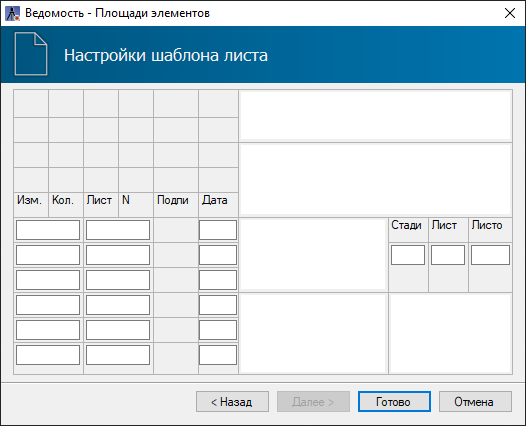

Задайте все необходимые настройки формирования ведомости и нажмите кнопку **Готово**. В результате в структуре проекта отобразится папка **Ведомости и чертежи**, в которой будет сформирована ведомость, и, в зависимости от ее формата, автоматически открыта в соответствующем редакторе.

## Ведомость объёмов



Ведомость объёмов создается по твердотельным объемам, которые в свою очередь формируются с помощью функции [Перестроить твердотельную модель площадки](utilities/rebuild_the_solidstate_model_of_the_platform.md).



Для формирования ведомости объёмов:

1. Выберите элемент меню **Площадки** - **Создать ведомость** - **Ведомость объёмов**;

2. Откроется стандартный мастер создания ведомостей:

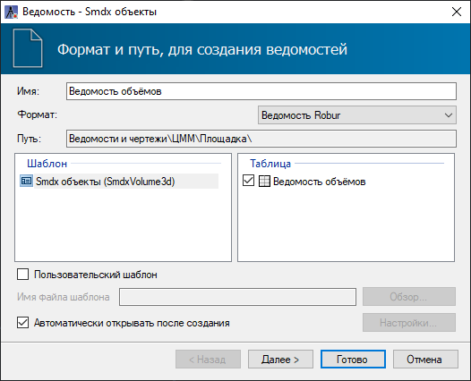

* **Имя** - в данном поле отображается наименование создаваемого файла ведомости. Данное поле редактируемое;

* **Формат** - в данном поле выбирается формат ведомости, в зависимости от редактора, в котором она будет открыта. По умолчанию ведомость представлена в формате **Robur**;

* В поле **Шаблон** представлен стандартный шаблон ведомости, согласно которому будет формироваться ведомость;

* В поле **Таблица** указываются формируемые разделы ведомости;

* Опция **Автоматически открывать после создания** позволяет автоматически открыть ведомость после ее создания.



При необходимости использования пользовательского шаблона установите опцию **Пользовательский шаблон** и выберите соответствующий файл с помощью кнопки **Обзор**. Механизмы настройки индивидуальных шаблонов ведомостей описаны в [Приложение Г. Редактирование динамических выходных ведомостей.](../doc/dynamic_vedomosti/edit_vedomosti_and_pattern.md)



При выборе формата **Ведомость Robur** нажмите **Далее** для дальнейших настроек.

3. На следующей вкладке необходимо указать модели, по которым будет создаваться Ведомость объёмов, после выбора нажмите **Далее**:

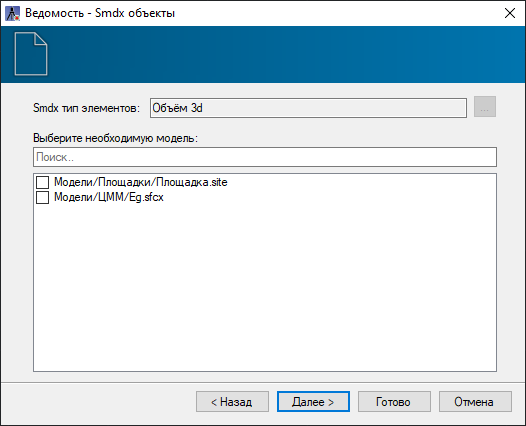

4. На вкладке **Шаблон листа** необходимо задать форматы листов и положение таблицы ведомости относительно границ листа, затем нажмите кнопку **Далее**:

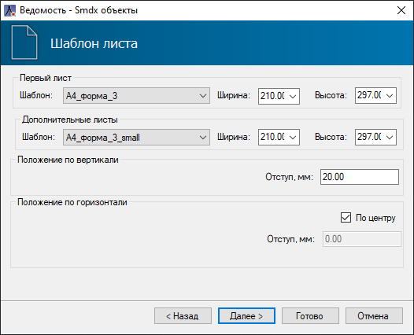



Если шаблон листа выбран **По умолчанию**, программа автоматически подберет формат листа по размеру ведомости.



5. На вкладке **Настройки шаблона листа** необходимо заполнить штамп ведомости:

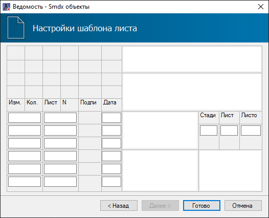

6. Задайте все необходимые настройки формирования ведомости и нажмите кнопку **Готово**. В результате в структуре проекта отобразится папка **Ведомости и чертежи**, в которой будет сформирована ведомость, и, в зависимости от ее формата, автоматически открыта в соответствующем редакторе.

