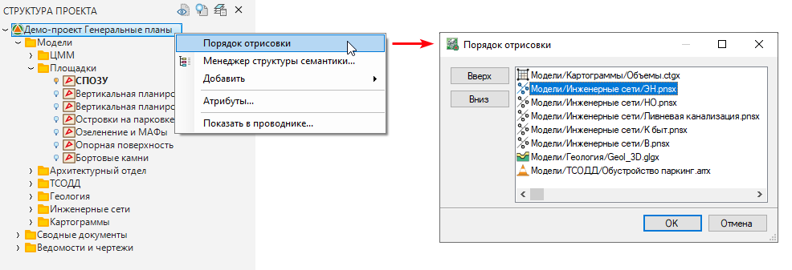
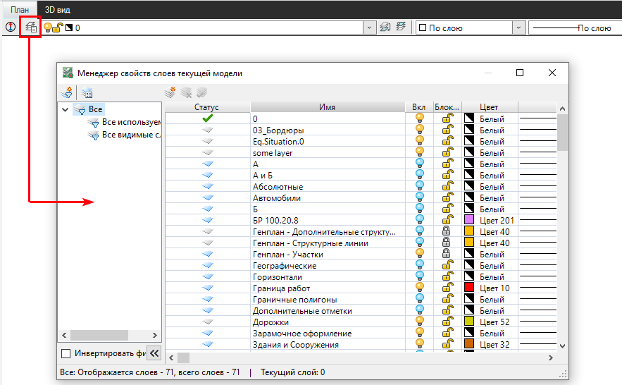
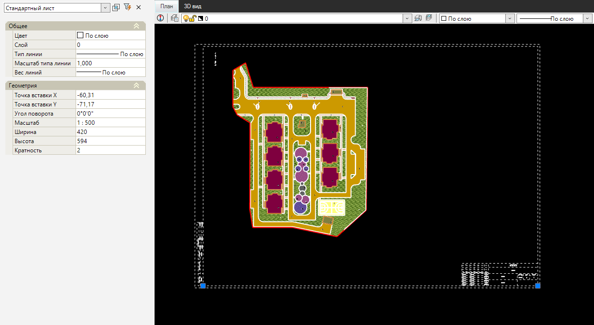
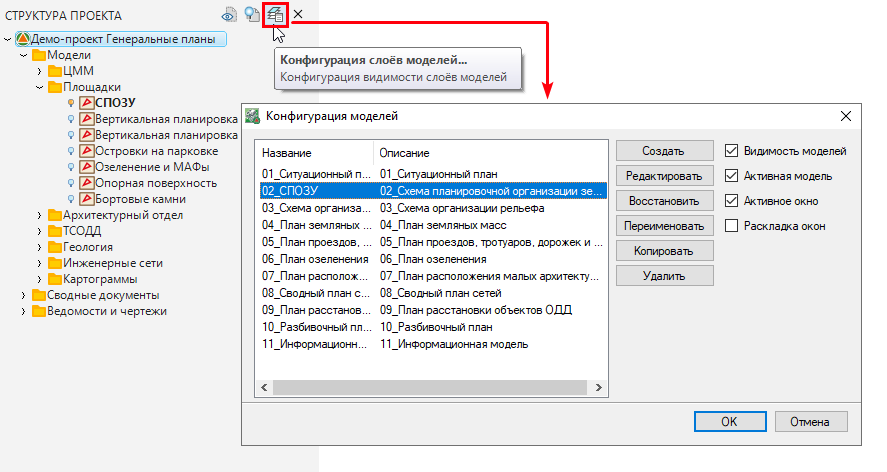
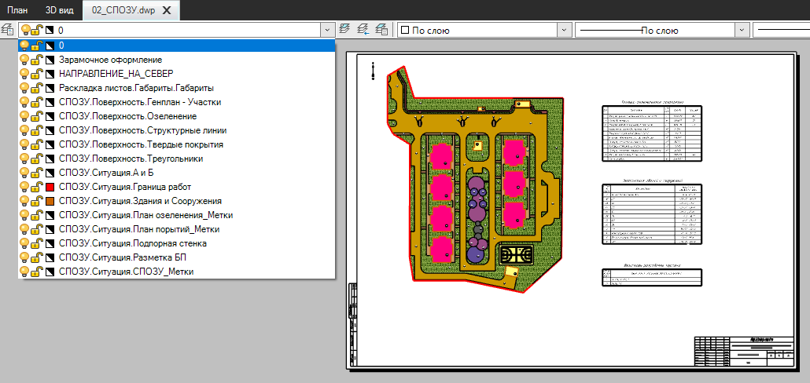
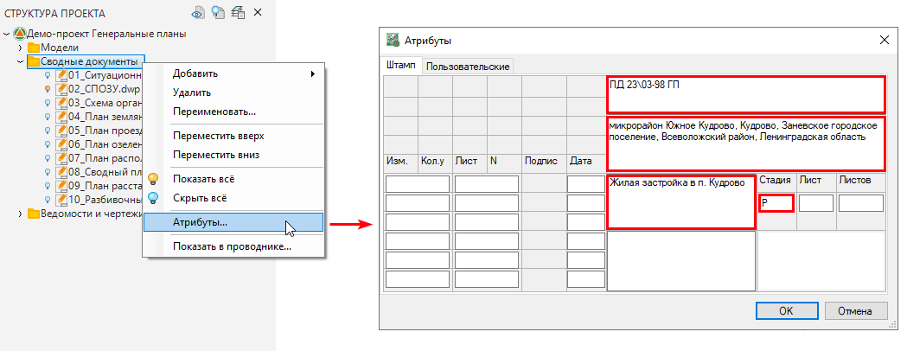
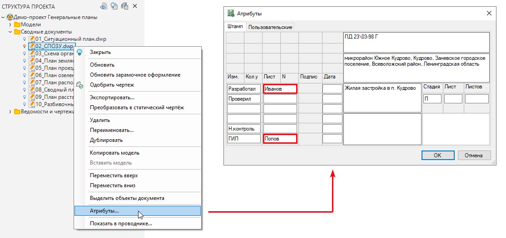
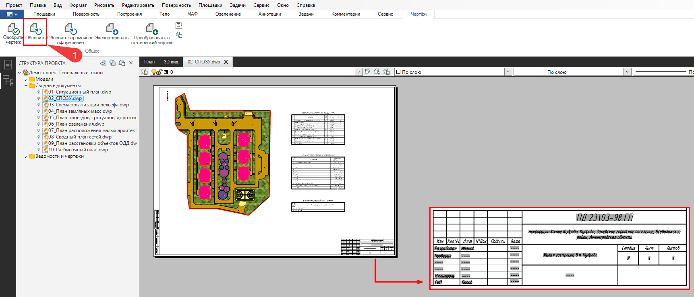

# Создание чертежей

Программа позволяет сформировать необходимый комплект выходных документов, соответствующий стадиям Проектной и Рабочей документаций.

Порядок формирования любого вида чертежа Плана общий:

1. Настраивается порядок отрисовки моделей и видимость нужных слоев плана.
2. В окне План вставляется Лист необходимого формата и шаблона.
3. Настроенный вид сохраняется в Именованную конфигурацию.
4. Формируется чертеж Листа.
5. Заполнение штампа чертежа

Рассмотрим основные этапы создания чертежа:

1. Так как на чертеж попадают только видимые элементы плана, поэтому предварительно необходимо настроить видимость моделей на плане:

Для этого в **Структуре проекта** настроим порядок отрисовки моделей, их видимость, а также слои:

2. Для вставки Листа выбираем меню **Рисовать – Планшет – Добавить лист**. Из раздела Шаблон выбираем нужный шаблон Листа.



Работа с [Пользовательскими шаблонами листов](../rb_survey/dtm/planchet/sheet_templates/add_user_template.md) были описаны ранее.



3. Сохраним настроенную конфигурацию видимости моделей в качестве именованной. Это позволит в любой момент вернуться к заданным настройкам видимости моделей.



Механизм по **управлению структурой проекта** (видимость и порядок отрисовки моделей), а также принцип работы инструмента **Конфигурации моделей** были описаны [ранее](../install_startup/startup/structure_project/structure_project_management.md).



4. Для создания файла чертежа выберите меню **Проект - Создать чертеж - План**.



Механизм по **созданию чертежа плана** и настройки **правила оформления плана** были описаны [ранее](../).



Таким образом на чертеж попали все видимые слои моделей:

Если чертеж создавался во внутреннем формате программы (формат dwp), то по умолчанию он является динамическим и может обновляться при внесении изменений в проекте.

1. Заполнение и редактирование штампа чертежа возможно через настройку **Атрибутов**.

Таким образом можно добиться того, что все созданные чертежи и ведомости будут автоматически создаваться с заполненным штампом, без необходимости вручную заполнять их при создании. Параметры атрибутов наследуются, соответственно, можно задать Атрибуты всей папке с выходной документацией разом (на примере папки **Сводные документы**), а конкретному документу (чертежу **СПОЗУ**) через Атрибуты задать ГИПа и Исполнителя:

При изменении модели чертежа или его штампа, чтобы внесенные изменения отобразились в области **Листа** необходимо либо нажать соответствующую кнопку на **Ленте**, либо в **Структуре проекта** щелкнуть правой кнопкой мыши на соответствующем чертеже и выбрать **Обновить**. В результате внесенные изменения в **Модели** отобразятся на **Листе**, причем внесенные ранее доработки в **Листе** сохранятся.

После обновления чертежа штамп будет обновлен согласно ранее отредактированным **Атрибутам**:



Дополнительные особенности динамического чертежа описаны в разделе [Динамический чертеж](../rb_survey/dtm/planchet/apportion_tablet/dynamic_drawing.md)



