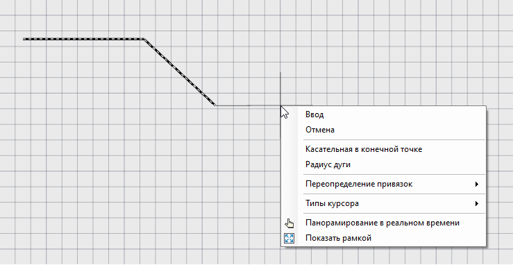
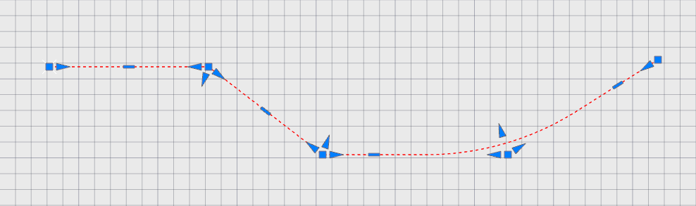

# Осевая линия

Данный функционал предназначен для быстрой отрисовки сети внутриквартальных проездов, а также дополнительных уширений различного назначения, например, под остановочные карманы. 

Особенностью этого функционала является то, что динамические примитивы позволяют быстро, параметрически или визуально, сделать необходимые плановые построения, при этом динамически связанные примитивы позволяют быстро и в любой момент времени внести изменения без потери исходных построений.

Проектирование происходит, как правило, с построения осевой линии, на которую будут опираться другие динамические построения (Смещения). Рассмотрим принцип построения осевой линии:

1. Выберите элемент меню **Рисовать – Смещение – Осевая линия**. Курсор примет форму прицела;

2. Последовательно укажите левой кнопкой мыши положение вершин углов осевой линии;

3. Для выхода из режима создания осевой линии нажмите правой кнопкой мыши и выберите **Ввод** или нажмите **Esc**.

При последовательном вводе планового положения вершин осевой линии можно вызвать контекстной меню правой кнопкой мыши и выбрать дополнительную опцию:

* Для выхода из режима построения и подтверждения ввода нажмите **Ввод**;

* Выберите элемент меню **Отменить** для выхода из режима ввода осевой линии;

* При выборе элемента меню **Касательная в конечной точке** появляется привязка курсора, которая позволяет поставить следующую вершину по касательной от предыдущей вершины. При этом появится вспомогательная пунктирная линия, проходящая точно через предыдущую вершину.

* При выборе элемента меню **Радиус дуги** можно задать радиус кругового сегмента оси. Для этого, введите значение радиуса дуги в строке динамического ввода, а затем, укажите положение конечной точки дуги.

* Выберите элемент меню **Переопределение привязок** для однократного изменения текущих привязок в процессе построения.

* Можно назначить режим объектного отслеживания ввода данных, выбрав элемент меню **Типы курсора**:

**Абсолютные координаты** - данный способ позволяет задать положение следующего узла по математическим координатам X и Y текущей системы координат;

**По расстоянию и углу** - данный способ позволяет задать длину сегмента, а так же угол сегмента относительно оси Х системы координат;

**По расстоянию и относительному углу** - данный способ позволяет задать длину сегмента, а так же угол сегмента относительно направления предыдущего сегмента;

**Относительное смещение** - данный способ позволяет ввести последующий сегмент линии сети относительно смещения по оси Х и Y текущей системы координат.

4. В результате будет создана осевая линия, которая будет состоять из вершин, выбранных в процессе ввода.

## Редактирование осевой линии

Программа имеет набор средств для контроля геометрии осевой линии в плане. Можно перетаскивать вершины углов перелома вместе со вписанными кривыми при помощи мыши, плоскопараллельно перемещать прямолинейные участки осевой линии, удалять и вставлять дополнительные вершины, при этом геометрия осевой линии не будет нарушена.

Перед началом редактирования осевой линии выделите ее, щелкнув по ней левой кнопкой мыши. При её выделении представить большой выбор грипов для редактирования.

* **Для перемещения вершины угла перелома** перетяните квадратный грип левой кнопкой мыши в требуемое место, либо щелкните по ней правой кнопкой мыши и из открывшегося контекстного меню выберите пункт **Растянуть**.

* **Для удаления вершины угла перелома** щелкните по ней правой кнопкой мыши и из открывшегося контекстного меню выберите пункт **Удалить вершину**.

* **Для добавления/изменения радиуса в вершине** щелкните по ней правой кнопкой мыши и из открывшегося контекстного меню выберите пункт **Величина радиуса, м**, либо перетяните левой кнопкой мыши центральную стрелку.

* **Для перемещения вершины угла перелома вдоль тангенса** перетяните левой кнопкой мыши стрелку, расположенную на соответствующем тангенсе, рядом с редактируемой вершиной, в требуемое место.

* **Для вставки дополнительной вершины угла перелома** нажмите ПКМ на прямоугольный грип прямолинейного сегмента осевой линии и из открывшегося контекстного меню выберите пункт **Добавить вершину**.

* **Для плоскопараллельного переноса** прямолинейного сегмента осевой линии перетяните левой кнопкой мыши прямоугольный грип в требуемое место, либо нажмите ПКМ на прямоугольный грип и из открывшегося контекстного меню выберите пункт **Растянуть**.
