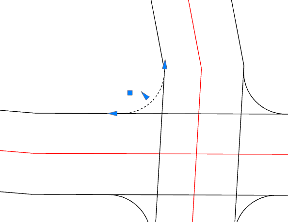
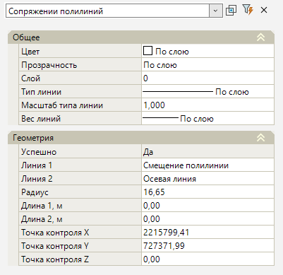

# Сопряжение смещений

Данная команда позволяет сопрячь между собой два динамических примитива радиусом, заданного значения. В качестве сопрягаемых элементов могут быть выбраны **Осевые линии** и **Смещения**.

Рассмотрим принцип построения сопряжения на элементах смещение:

1. Выберите элемент меню **Рисовать (Построения) – Смещение – Сопряжение смещений**. Курсор примет форму прицела;

2. Укажите первую линию для динамического сопряжения;

3. Укажите вторую линию для динамического сопряжения;

4. Далее через поле динамического ввода укажите числовое значение **Радиуса дуги сопряжения**.

5. Укажите графически мышкой контрольную точку для определения стороны сопряжения, чтобы программа построила сопряжение в выбранной четверти пересечения.

В результате на динамических смещениях будет построена дуга сопряжения с заданным в процессе ввода радиусом. Программа имеет набор средств для контроля геометрии сопряжения. **Сопряжение** можно редактировать графически через грипы, а также через свойства элемента **Сопряжение**.

Перед началом редактирования **Сопряжения** выделите его, щелкнув по нему левой кнопкой мыши. При его выделении появится выбор грипов для редактирования:

* Для редактирования **Радиуса сопряжения** нажмите на треугольный грип по середине дуги и укажите графически на плане новое положение радиуса.

* Для редактирования **Длины дуги** вдоль первой/второй линии смещений нажмите на треугольный грип, который находится на первой/второй линии смещения и переместите его вдоль линии.

* Для редактирования планового положения **Точки контроля**, по которой определяется сторона сопряжения нажмите на квадратный грип и переместите его в необходимую четверть.

## Свойства сопряжения

Для редактирования параметров созданного сопряжения необходимо его выбрать и открыть окно **Свойства**:

### Общее

Данная группа содержит общую информацию о смещении:

* **Слой** – по умолчанию смещение создается в текущем слое;



 Подробнее о данном функционале описано в Документации [Том 2. Запуск и настройка Топоматик Robur, гл. Работа со слоями модели.](../../../install_startup/startup/working_with_layers_model/manager_layers.md)



* **Цвет** – в данном выпадающем списке задается цвет выбранного элемента;

* **Прозрачность** – параметр, определяющий прозрачность элемента сопряжение. Установите нужное значение, задав в поле ввода значение в диапазоне от 0 до 100;

* **Тип линии** – в данном выпадающем списке задается тип линии выбранного элемента. По умолчанию для смещения задан тип линии «По слою»;

* **Масштаб типа линии** – это масштабный коэффициент, который применяется к образцу начертания линии и позволяет менять длину штрихов и других объектов, из которых линия состоит. По умолчанию для смещения задан масштаб «1»;

* **Вес типа линии** – в данном выпадающем списке задается толщина типа линии выбранного элемента. По умолчанию для смещения задан вес типа линии «По слою».

### Геометрия

* **Линия 1 / Линия 2** - в данных параметрах прописывается наименование базовых исходных линий, по котором был задан элемент сопряжение. Нажав пиктограмму , программа находит базовую исходную линию в окне План. Нажав пиктограмму , можно переназначить исходную базовую линию смещения, выбрав её в окне План, сопряжение будет перестроено;

* **Радиус** - данный параметр позволяет задать числовое значение радиуса внутри дуги элемента сопряжение;

* **Длина 1 / Длина 2** - данные параметры позволяют задать числовые значения длин концов дуги сопряжения вдоль первой/второй линий смещений;

* **Точка контроля X/Y/Z** - данные параметры позволяют задать числовые значения координат X/Y/Z, по которым строится контрольная точка в трехмерном пространстве.
