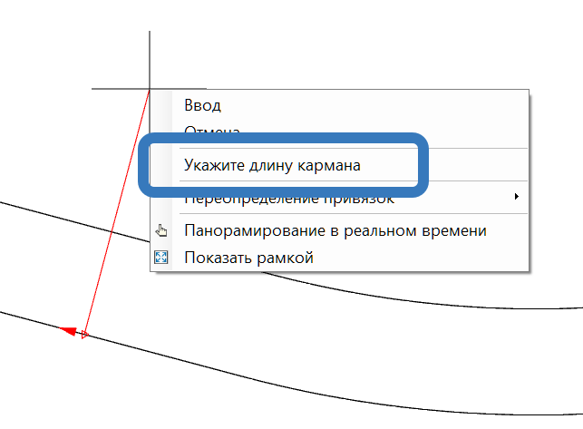

# Карман на смещении

Данная функция позволяет быстро отрисовать парковочный карман с необходимыми параметрами его ширины, длины и отгонов.

Рассмотрим принцип построения кармана на элементе смещение:

1. Выберите элемент меню **Рисовать (Построения) – Смещение – Карман на смещении**. Курсор примет форму прицела;

2. Укажите исходную линию динамического смещения, на которой будет построен карман;

3. Курсор будет перемещаться с привязкой к выбранной исходной линии. Положение границ **Начала** и **Конца кармана** можно указать либо визуально **ЛКМ**, либо задать конкретные значения **Начала** и **Конца кармана** через поля динамического ввода, либо после указания **Начала кармана** нажать **ПКМ** и выбрав соответствующую опцию, задав нужное значение **Длины кармана**:

4. Укажите графически мышкой на плане **Ширину кармана**, либо через поле динамического ввода задайте величину ширины кармана.

5. Далее через поле динамического ввода укажите числовое значение **Отгона кармана**.

6. Нажмите на клавишу **Enter** для завершения функции.

В результате на динамическом смещении будет построен **Карман** с заданными в процессе ввода параметрами. Этот способ является более быстрым и удобным вариантом построения **Парковочных карманов**, которые также возможно создать через функционал **Смещений**.

Функционал редактирования **Кармана** аналогичен функционалу работы со **Смещениями** и был описан [ранее](offset_graphically.md).
