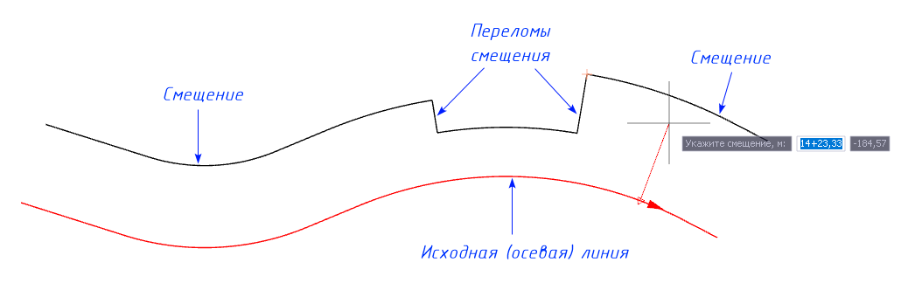
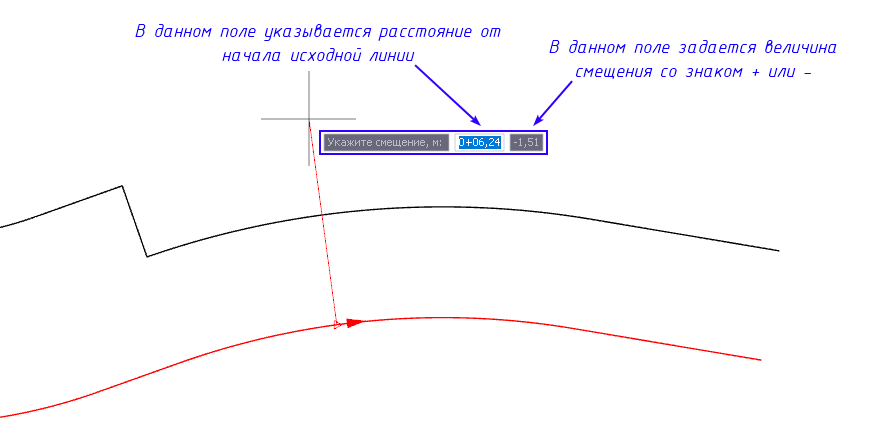
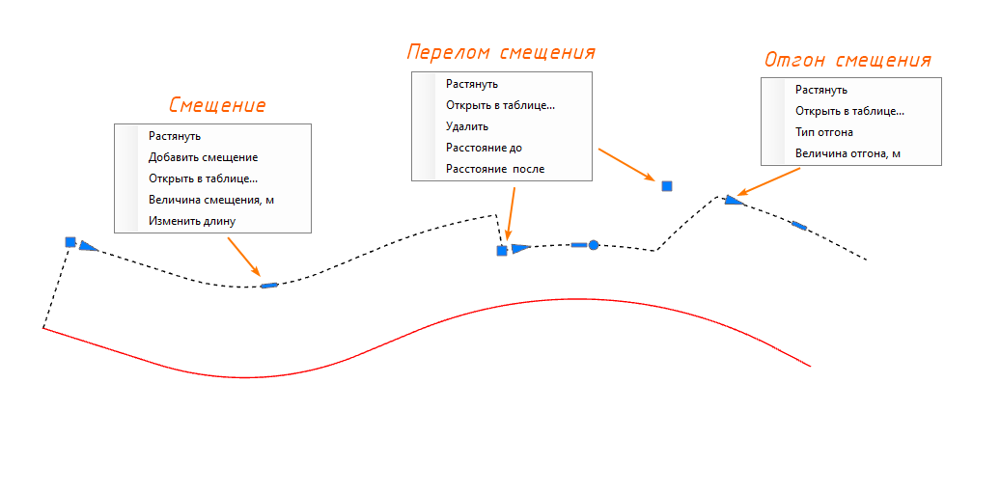
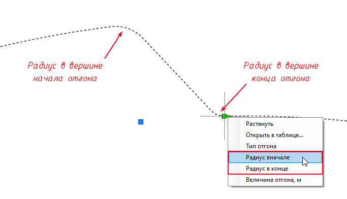
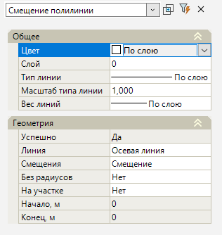

# Смещение графически

## Создание

Рассмотрим принцип построения динамического смещения графическим способом:

1. Выберите элемент меню **Рисовать (Построения) – Смещение – Смещение графически**. Курсор примет форму прицела;

2. Укажите исходную Осевую линию или ранее отрисованное Смещение, относительно которого требуется построить элемент **Смещение**;

3. Курсор будет перемещаться с привязкой к контуру линии, ЛКМ последовательно укажите положение точек смещения, а именно расстояние и сторону смещения относительно исходной линии. В процессе построения команда будет активна для создания необходимых переломов:

При этом, необходимое расстояние, сторону и величину смещения можно указать как визуально, так и задать конкретные значения в строке динамического ввода, переключаясь между полями кнопкой **Tab**:

4. Для выхода из режима создания смещения нажмите ПКМ или нажмите **Esc**. В результате будет создано смещение с заданными в процессе ввода переломами.

## Редактирование

Программа имеет набор средств для контроля геометрии элемента смещения в плане. Смещение можно редактировать графически через грипы, а также через контекстное меню.

Перед началом редактирования смещения выделите его, щелкнув по нему левой кнопкой мыши. При его выделении появится большой выбор грипов для редактирования:

### Величина смещения

* Для редактировании **Величины смещения** перетяните левой кнопкой мыши прямоугольный грип в требуемое место, либо нажмите ПКМ на прямоугольный грип и из открывшегося контекстного меню выберите пункт **Растянуть**, либо пункт **Величина смещения, м**, далее задайте числовое значение смещения - положительное значение отложит смещение справа от оси, отрицательное значение отложит смещение слева от оси.

* Для **Добавления смещения** в уже созданную геометрию нажмите ПКМ на прямоугольный грип и из открывшегося контекстного меню выберите пункт **Добавить смещение**, курсор начнет перемещаться с привязкой к контуру базовой линии, ЛКМ последовательно укажите новое положение смещения, а именно расстояние и сторону смещения относительно исходной линии.

* Для редактирования **Длины смещения** нажмите ПКМ на прямоугольный грип и из открывшегося контекстного меню выберите пункт **Изменить длину**, далее задайте числовое значение длины смещения относительно его начала.

* Для редактирования **Геометрии смещения** через таблицу нажмите ПКМ на прямоугольный грип и из открывшегося контекстного меню выберите пункт **Открыть в таблице...**, откроется окно редактирования геометрии смещения, в котором будет выделено выбранное смещение. Более подробно принцип работы таблицы будет описан в разделе [Смещение через таблицу](offset_through_through.md).

### Переломы смещения

* Для **редактирования Переломов смещения** перетяните левой кнопкой мыши квадратный грип в требуемое место, либо нажмите ПКМ на квадратный грип и из открывшегося контекстного меню выберите пункт **Растянуть**, либо пункты **Расстояние до/после**, далее задайте значение длины смещения до или после выбранного перелома .

* Для **удаления Переломов смещения** нажмите ПКМ на квадратный грип и из открывшегося контекстного меню выберите пункт **Удалить**.

* Для редактирования **Геометрии перелома** через таблицу нажмите ПКМ на квадратный грип и из открывшегося контекстного меню выберите пункт **Открыть в таблице...**, откроется окно редактирования геометрии смещения, в котором будет выделено Смещение, к которому относится перелом. Более подробно принцип работы таблицы будет описан в разделе [Смещение через таблицу](offset_through_through.md).

### Отгон величины смещения

* Для **Отгона величины смещения** перетяните левой кнопкой мыши треугольный грип в требуемое место, либо нажмите ПКМ на треугольный грип и из открывшегося контекстного меню выберите пункт **Растянуть**, либо пункт **Величина отгона, м**, далее задайте числовое значение величины отгона.

* Для задания **Типа отгона** нажмите ПКМ на треугольный грип и из открывшегося контекстного меню выберите пункт **Тип отгона**. При выборе типа отгона **В вершине / Внутри** можно также через контекстное меню задать **Радиус в начале / Радиус в конце**. При выборе параметра вписывать радиусы **В вершине**, заданные значения радиусов будут вписаны по центру вершин начала и конца отгона смещения. При выборе параметра вписывать радиусы **Внутри**, заданные радиусы будут отложены от вершин начала и конца отгона смещения внутрь самого отгона.

* Для редактирования **Отгона** через таблицу нажмите ПКМ на прямоугольный грип и из открывшегося контекстного меню выберите пункт **Открыть в таблице...**, откроется окно редактирования геометрии смещения, в котором будет выделено выбранное Смещение, к которому относится отгон. Более подробно принцип работы таблицы будет описан в разделе [Смещение через таблицу](offset_through_through.md).



 Вся конструкция является динамической, при изменении одних элементов (например, исходной осевой линии) изменяются другие зависимые элементы (например, смещения).



## Свойства смещения

Для редактирования параметров созданного смещения необходимо выбрать смещение и открыть окно **Свойства**:

### Общее

Данная группа содержит общую информацию о смещении:

* **Слой** – по умолчанию смещение создается в текущем слое;



 Подробнее о данном функционале описано в Документации [Том 2. Запуск и настройка Топоматик Robur, гл. Работа со слоями модели.](../../../install_startup/startup/working_with_layers_model/manager_layers.md)



* **Цвет** – в данном выпадающем списке задается цвет выбранного элемента;

* **Тип линии** – в данном выпадающем списке задается тип линии выбранного элемента. По умолчанию для смещения задан тип линии «По слою»;

* **Масштаб типа линии** – это масштабный коэффициент, который применяется к образцу начертания линии и позволяет менять длину штрихов и других объектов, из которых линия состоит. По умолчанию для смещения задан масштаб «1»;

* **Вес типа линии** – в данном выпадающем списке задается толщина типа линии выбранного элемента. По умолчанию для смещения задан вес типа линии «По слою».

### Геометрия

* **Линия** - в данном параметре прописывается наименование базовой исходной линии, по которому был задан элемент смещение. Нажав пиктограмму , программа находит базовую исходную линию в окне План. Нажав пиктограмму , можно переназначить исходную базовую линию смещения, выбрав её в окне План, смещение будет перестроено.

* **Смещение** - данный параметр позволяет отредактировать геометрию элемента смещение через таблицу. Для этого нажмите на пиктограмму , откроется окно редактирования смещения. Более подробно принцип работы таблицы будет описан в разделе [Смещение через таблицу](offset_through_through.md).

* **Без радиусов** - данная опция при выборе значения **Нет** повторяет геометрию исходной базовой линии с учетом величин радиусов в вершинах исходной базовой линии. При выборе значения **Да** величины радиусов в вершинах исходной базовой линии не будут учитываться при построении элемента смещение.

* **На участке** - данная опция при выборе значения **Да** позволяет отредактировать границы смещения относительно исходной базовой линии. Редактирование границ возможно либо через квадратные грипы на базовой исходной линии, либо через разблокированные параметры **Начало, м / Конец, м**, в которые задаются числовые значения расстояния от начала исходной базовой линии.

