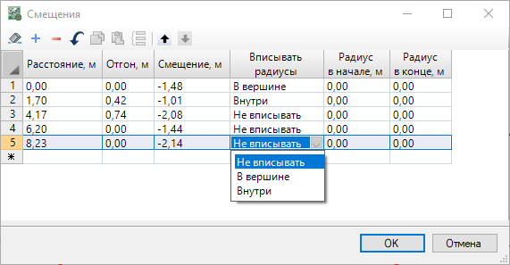

# Смещение через таблицу

Рассмотрим принцип построения динамического смещения через таблицу. Для этого:

1. Выберите элемент меню **Рисовать (Построения) – Смещение – Смещение через таблицу**. Курсор примет форму прицела;

2. Укажите исходную **Осевую линию** или ранее отрисованное **Смещение**, относительно которого требуется построить элемент **Смещение**;

3. Откроется окно редактирования геометрии смещения:

В верхнем поле слева с помощью пиктограмм можно отредактировать таблицу: **Очистить таблицу**, **Вставить/Удалить строку** таблицы, **Отменить** действие, **Переместить вверх/вниз** выбранную строку.

* **Расстояние** - данный параметр позволяет отредактировать положение начала смещения относительно начала исходной базовой линии через задание числового значения.

* **Отгон** - данный параметр позволяет задать числовое значение отгона, то есть расстояние от перелома смещения до начала следующего смещения.

* **Смещение, м** - расстояние между исходной базовой линии и элементом смещение. Данный параметр позволяет отредактировать **Величину смещения** через задание числового значения - положительное значение отложит смещение справа от оси, отрицательное значение отложит смещение слева от оси.

* **Вписывать радиусы** - данная опция позволяет помимо настройки по умолчанию **Не вписывать** радиусы выбрать другие параметры. При выборе параметра вписывать радиусы **В вершине**, заданные значения радиусов будут вписаны по центру вершин начала и конца отгона смещения. При выборе параметра вписывать радиусы **Внутри**, заданные радиусы будут отложены от вершин начала и конца отгона смещения внутрь самого отгона.

* **Радиус вначале, м Радиус в конце, м** - данный параметр позволяет задать числовое значение радиуса в начале отгона и в конце отгона.

4. Для завершения построения элемента смещения нажмите кнопку **ОК**. В результате будет создано смещение с заданными в процессе ввода переломами/отгонами.

