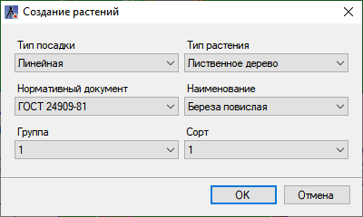
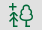
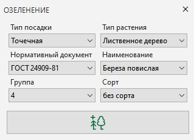

# Добавление элементов Озеленения

В данном разделе справки будут описаны принцип добавления элементов **Озеленения** в модель Площадка.

Для добавления растений:

1. Выберите элемент меню **Озеленение - Общее - Создание растений**;

2. При первом запуске функции программа предлагает выбрать регион из предложенного списка. Это необходимо для определения свойства габаритов **Ямы** растения, которые зависят от выбранного региона.



 Для редактирования региона перейдите в меню **Сервис - Настройки**. В окне **Настройки среды**, в разделе **Озеленение** возможна корректировка региона (Местоположение).



3. Откроется диалоговое окно **Создание растений**. В данном окне необходимо выбрать следующие критерии: Тип посадки, Тип растения. В зависимости от выбранного Типа растения программа предложит выбрать возможные варианты свойств Нормативный документ, Наименование, Группа, которые присвоены для данного Типа растения по Библиотеке 3D моделей.

4. После настройки всех критериев нажмите кнопку **ОК**.

* Если в качестве Типа посадки была выбрана **Точечная посадка**, программа попросит последовательно указать точки вставки элементов Озеленения, для завершения функции нажмите кнопку **Enter**.
* При выборе в качестве Типа посадки **Линейная** или **Живая изгородь** программа предложить указать первую и последующие точки вставки осевой линии, вдоль которой пойдет построение элементов Озеленения. Для завершения функции нажмите кнопку **Enter**.



 Добавление элементов Озеленения также возможно через Левую/Правую панель управления. Нажмите ПКМ на панель управления - Озеленение, откроется окно создания растений. Нажмите пиктограмму , чтобы добавить элемент Озеленения в окне План:

 



Добавленные элементы Озеленения будут автоматически спроецированы либо на поверхность текущей модели, либо при ее отсутствии на поверхность земли, которая указана в [Настройках](../../../genplan/creating_ground_model.md) модели Площадка в разделе ЦММ.

