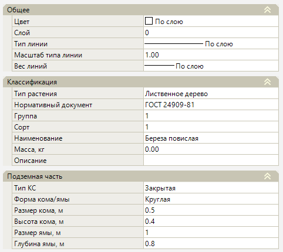
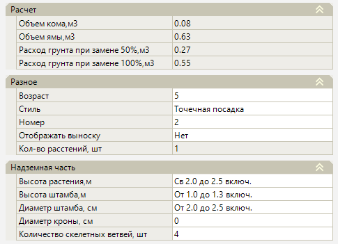

# Свойства элементов Озеленения

В данном разделе справки будут описаны параметры и свойства элементов Озеленения.

Элементы Озеленения подразделяются на три Типа посадки: **Точечная посадка**, **Линейная** и **Живая изгородь**.

При выборе элемента Озеленения основные его характеристики отображаются в окне **Свойства**. Рассмотрим основные свойства элемента на примере Типа посадки **Точечная посадка**.

## Общие

Данная группа свойств содержит общую информацию о элементе Озеленения:

* **Слой** – по умолчанию все элементы расположены на именованных слоях. При необходимости изменения наименования какого-либо слоя воспользуйтесь меню **Формат - Менеджер слоев**;



 Подробнее о данном функционале описано в Документации [Установка. Запуск и настройка. Работа со слоями модели.](../../../../ru/install_startup/startup/working_with_layers_model/manager_layers.md)



* **Цвет** – в данном выпадающем списке задается цвет подписи **Наименования** выбранного элемента и осевой линии, если выбран Тип посадки Линейная или Живая изгородь;

* **Тип линии** – в данном выпадающем списке задается тип линии выбранного элемента. По умолчанию для всех растений задан тип линии «По слою»;

* **Масштаб типа линии** – это масштабный коэффициент, который применяется к образцу начертания линии и позволяет менять длину штрихов и других объектов, из которых линия состоит. По умолчанию для всех растений задан масштаб «1»;

* **Вес типа линии** – в данном выпадающем списке задается толщина типа линии выбранного элемента. По умолчанию для всех растений задан вес типа линии «По слою».

## Классификация

Данная группа свойств содержит информацию о выбранном Типе растения:

* **Тип растения** – в данном выпадающем списке задается Тип растения: Лиственное дерево, Хвойное дерево, Лиственный кустарник, Хвойный кустарник. Выбранный Тип растения является в своем роде фильтром для последующего выбора элемента Растение в разделе Наименование из **Библиотеки 3D моделей**;

* **Наименование** – соответствует идентификатору элемента в **Библиотеке 3D моделей**, с помощью данного свойства можно заменить по фильтру **Тип растения** выбранное растение на другое, имеющееся в **Библиотеке 3D моделей**;

* **Нормативный документ** – документ (ГОСТ), выбор которого определяет значение группы свойств **Классификация**, **Надземная часть**, а также часть информации по группе свойств **Подземная часть**: Тип КС, Форма кома/ямы, Размер кома, Высота кома. Данные группы свойств будут описаны далее;



 Добавление и редактирование нормативных документов осуществляется в окне [Редактора нормативных документов](parameter_editors.md).



* **Группа** – в данном выпадающем списке назначается группа элемента Растение согласно **Нормативному документу**;

* **Подгруппа** – в данном выпадающем списке назначается подгруппа элемента Растение согласно **Нормативному документу**;

* **Сорт** – в данном выпадающем списке назначается сорт элемента Растение согласно **Нормативному документу**;

* **Масса, кг** – в данном выпадающем списке назначается масса элемента Растение согласно **Нормативному документу**;

* **Описание** – в данном свойстве возможно прописать дополнительную информацию по элементу Растение.

## Подземная часть

Данная группа свойств содержит информацию о Подземной части элемента Озеленения:

* **Тип КС** – в данном выпадающем списке задается тип корневой системы **Открытая/Закрытая** согласно **Нормативному документу**.

* **Форма кома/ямы** – в данном выпадающем списке задается Квадратная или Круглая форма кома/ямы согласно **Нормативному документу**.

* При **Закрытой** корневой системе программа задает свойства **Размер кома, м**, **Высота кома, м** согласно **Нормативному документу**;

* При **Открытой** корневой системе программа задает свойства **Диаметр КС, см**, **Длина КС, см** согласно **Нормативному документу**. При этом штриховка на плане, которая является отображением Кома, будет скрыта.

* **Размер ямы, м** – в данном свойстве прописывается числовое значение Размера ямы. Данное свойство заполнено согласно выбранному **Региону**;

* **Глубина ямы, м** – в данном свойстве прописывается числовое значение глубины ямы. Данное свойство заполнено согласно выбранному **Региону**;

## Расчет

Данная группа свойств содержит расчетную информацию по элементу **Озеленения**, которые вычисляются исходя из заданных свойств в разделе **Подземная часть**:

* **Объем кома, м3** - объем земляного кома зависит от заданной **Формы кома** (Квадратная/Круглая) и вычисляется исходя из числовых значений **Размера и Высоты кома**. Данные параметры задаются в разделе **Подземная часть**;

* **Объем ямы, м3** - объем посадочной ямы зависит от заданной **Формы ямы** (Квадратная/Круглая) и вычисляется исходя из числовых значений **Размера и Глубины ямы**. Данные параметры задаются в разделе **Подземная часть**;

* **Расход грунта при замене 50%, м3** - данное значение рассчитывается, как половина от разности значений **Объема кома** и **Объема ямы**;

* **Расход грунта при замене 100%, м3** - данное значение рассчитывается, как разность значений **Объема кома** и **Объема ямы**.

## Разное

В данной группе свойств представлен ряд дополнительных информационных характеристик элемента Озеленения:

* **Возраст** – в данном свойстве прописывается числовое значение возраста элемента Растение. Данное свойство заполнено согласно **Нормативному документу**;

* **Стиль** – в данном выпадающем списке задается стиль посадки элемента Растение: Групповая посадка, Живая изгородь, Линейная посадка, Точечная посадка. Выбранный стиль посадки определяет настройки 



 **Настройки стилей озеленения** редактируются через одноименную функцию, принцип работы которой будет описан далее в справке .



* **Номер** – порядковый номер элемента Растение. Настроить [Автонумерацию](grouping.md) элементов Растение по определенному критерию возможно в соответствующем разделе;

* **Отображать выноску** – при выборе значений **Да/Нет** программа включит/отключит видимость выноски элемента Растение;

* **Кол-во растений, шт** – данное свойство отображает числовое значение количества растений, которое принадлежит к выбранному элементу Растение.

## Надземная часть

Данная группа свойств содержит информацию о Надземной части элемента Озеленения. Данные свойства заполнены согласно **Нормативному документу**, при этом значения доступны для редактирования:

* Высота растения, м
* Высота штамба, м
* Диаметр штамба, см
* Диаметр кроны, см
* Количество скелетных ветвей, шт

## Дополнительные свойства

У каждого Типа посадки есть дополнительный ряд Свойств.

Тип посадки - Точечная посадка:

* **Точка вставки X/Y/Z** - координаты базовой точки вставки элемента Растение. Координаты базовой точки могут задаваться графически. Для этого выделите поле с соответствующей координатой (X или Y) и нажмите кнопку , курсор будет привязан к точке вставки узла, укажите требуемое положение точки. Отметка Z принимается по назначенной поверхности в [Настройках модели площадка](../../../genplan/creating_ground_model.md);

* **Угол поворота** - в поле ввода визуально, с помощью соответствующей кнопки  или при введении значения с помощью клавиатуры задается угол поворота базовой точки элемента Растение.

Тип посадки - Линейная посадка:

* **Замкнута** – при выборе значений **Да/Нет** программа определит необходимость соединения начала и конца осевой линии Линейной посадки;
* **Только на вершинах** – при выборе значений **Да/Нет** программа определит принцип расстановки элементов растений. При выборе значения **Нет** появится параметр **Шаг, м** для назначения шага расстановки элементов растений;
* **Левый ряд/Правый ряд** – при выборе значений **Да/Нет** программа определит необходимость добавления параллельных рядов слева или справа от осевой линии Линейной посадки. При выборе значения **Да** появятся дополнительные параметры **Метод посадки** (Шахматная/Параллельная) и **Отступ, м**.

Тип посадки - Живая изгородь:

* **Замкнута** – при выборе значений **Да/Нет** программа определит необходимость соединения начала и конца осевой линии Живой изгороди;
* **Тип траншеи** – в данном выпадающем списке задается тип траншеи **Однорядная/Двухрядная**;
* **Кол-во кустов на п.м., шт.** – в данном параметре задается числовое значение количества кустов на один погонный метр Живой изгороди.

