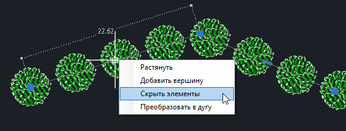
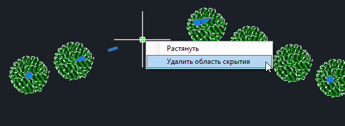
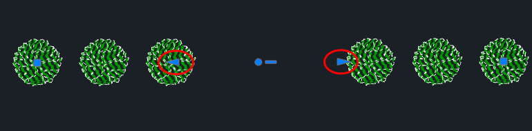

# Редактирования элементов Озеленения

Для редактирования Типа посадки **Линейная посадка** предусмотрены следующие функции:

## Обрезать линию

Данная функция позволяет обрезать осевую линию (примитив) **Линейной посадки** до крайнего растения. При этом параллельные ряды Линейной посадки, которые задаются через [Свойства элемента растения](general.md), обрезаться не будут.

## Добавить область скрытия

Данная функция позволяет скрыть элементы Озеленения в выделенной области. Для этого:

1. Курсор примет форму прицела, укажите ЛКМ в окне План объект (осевую линию) Линейной посадки, относительно которого будет создаваться участок скрытия.

2. Курсор будет перемещаться с привязкой к контуру осевой линии, ЛКМ последовательно укажите первую и вторую точку участка скрытия.

В диапазоне указанного участка программа скроет элементы Растение.



 Скрытие элементов растений также возможно через грипы осевой линии (примитива) Линейной посадки. Для этого выделите осевую линию и нажмите ПКМ на центральный прямоугольный грип - **Скрыть элементы**.

 

 Если осевая линия (примитив) является ломанной, то скрытие элементов произойдет только на выбранном участке.



## Удалить все области скрытия

Данная функция позволяет удалить все области скрытия у выбранной осевой линии (примитива) **Линейной посадки**.



 Удаление области скрытия также возможно через грипы осевой линии (примитива) **Линейной посадки**. Для этого выделите осевую линию и нажмите ПКМ на центральный круглый грип - **Удалить область скрытия**.

 

 Если осевая линия (примитив) является ломанной, то удаление области скрытия произойдет только на выбранном участке.



Редактирование области скрытия возможно через треугольные грипы, перемещая их вдоль осевой линии (примитива) **Линейной посадки**:

