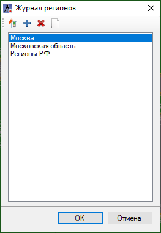
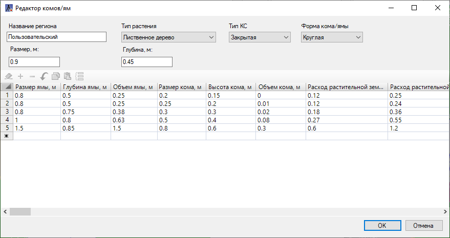
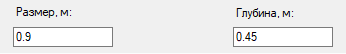
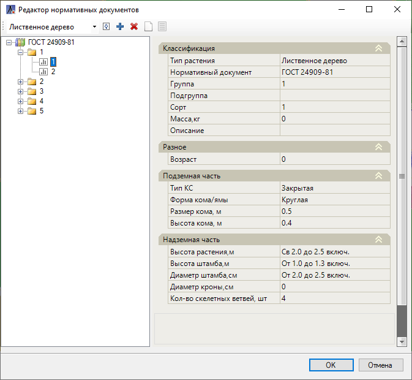
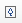
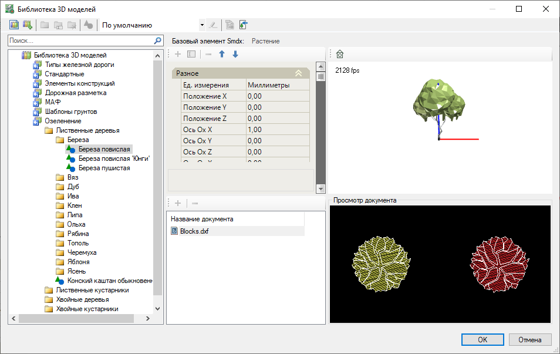

# Редакторы параметров

В данном разделе описываются принципы работы **Редактора комов/ям**, **Редактора нормативных документов**, а также элементы **Озеленения** в Библиотеке 3D объектов.

## Редактор комов/ям

Для редактирования региона и определения свойств габаритов **Ямы** растения:

1. Выберите элемент меню **Озеленение - Редакторы параметров - Редактор комов/ям**;

2. Откроется окно **Журнал регионов**. По умолчанию в программу добавлены три системных региона, которые доступны для просмотра и закрыты для редактирования:

* При нажатии пиктограммы  будет добавлен новый регион.
* При нажатии пиктограммы  выбранный пользовательский регион будет удален
* Пиктограмма  позволяет дублировать уже созданный регион со всеми параметрами и настройками.
* Для редактирования региона нажмите пиктограмму  . Откроется диалоговое окно **Редактора комов/ям**, при этом Системные регионы и их свойства будут доступны для просмотра и закрыты для редактирования.

* В таблице по выбранному пользовательскому региону для каждого **Типа растений** и его параметров можно заполнить значения габаритов элемента **Яма** и элемента **Кома**. В зависимости от габаритов **Кома**, будут подбираться значения по габаритам **Ямы**.



 Габариты Кома элемента Озеленения задаются согласно ГОСТу, который указывается в свойстве **Нормативный документ**. Описание [Свойств элементов растений](general.md) представлено в соответствующем разделе.



* Если в таблице нет соответствующих значений по габаритам **Кома**, то значения по габаритам **Ямы** будут задаваться по умолчанию по свойствам таблицы **Размер, м** и **Глубина, м**:

* При нажатии пиктограмм  у **Закрытых КС** можно Очистить таблицу полностью, Вставить или Удалить выделенную строку.

Для сохранения всех изменений в окне **Редактора комов/ям** нажмите клавишу **ОК**.

## Редактор нормативных документов

Для редактирования нормативных документов:

1. Выберите меню **Озеленение - Редакторы параметров - Редактор нормативных документов**;

2. Откроется окно Редактора нормативных документов. В верхнем поле слева из выпадающего списка можно выбрать **Тип растения**, по которому происходит фильтрация Нормативных документов. По умолчанию для каждого Типа растения добавлен один системный нормативный документ (ГОСТ), который в свою очередь заблокирован для редактирования.

Дерево Нормативного документа подразделяется на уровни: **Нормативный документ, Группы, Сорта** и **Подгруппы**. Нормативные документы, которые добавлены пользователями, буду доступны для редактирования. Для этого:

* При нажатии пиктограммы  будет добавлен выбранный уровень дерева Нормативного документа: сам **Нормативный документ, Группа, Сорт, Подгруппа**.
* При нажатии пиктограммы  будет удален выбранный уровень дерева Нормативного документа: сам **Нормативный документ, Группа, Сорт, Подгруппа**. В том случае, когда на уровне остается один элемент, его удаление возможно только через удаление родительского уровня. Например, если в **Группе** находится всего один **Сорт**, то удаление уровня **Сорт** происходит через удаление его родительского уровня - **Группы**.
* Пиктограммы  и  позволяют скопировать и вставить уровни дерева Нормативного документа: сам **Нормативный документ, Группа, Сорт, Подгруппа**.
* Пиктограмма  позволяет добавить или удалить Подгруппы в дереве Нормативного документа на всех существующих уровнях **Сорт** выбранного нормативного документа в зависимости от того, были ли они созданы ранее или нет. При удалении Подгрупп программа запросит подтверждение на удаление.

В поле справа задаются значения параметров группы **Свойств**: Классификация, Разное, Подземная часть, Надземная часть. Согласно **Нормативному документу** (ГОСТу) данные значения будут заполнены в Свойствах элементов растений.



 Подробное описание групп **Свойств** было рассмотрено в разделе [Свойства элементов растений.](general.md)



Для сохранения всех изменений в окне **Редактора нормативных документов** нажмите клавишу **ОК**.

## Элементы Озеленения в Библиотеке 3D объектов

В модуле Генеральные планы элементами **Озеленения** являются объекты, у которых в **Библиотеке 3D моделей** в качестве **Базового элемента smdx** из библиотеки **Менеджер структуры smdx** назначен элемент ИМ **Растение**.



 Чтобы добавить пользовательский элемент **Озеленения**, предварительно создайте пользовательскую библиотеку в **Библиотеке 3D моделей**. Общие принципы работы с библиотеками данных представлены в приложении [Приложение. Библиотеки данных](../../../../ru/annex/libraries/libraries_info.md).



