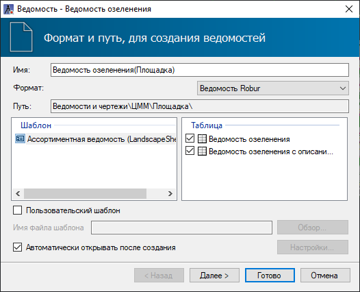
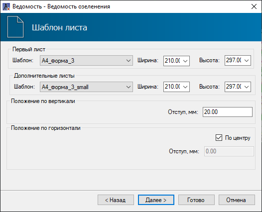
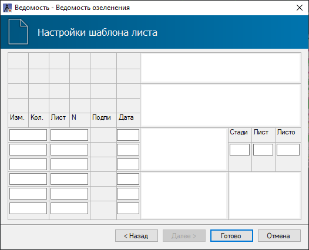

# Ведомость озеленения

После созданной [Автонумерации](grouping.md) элементов Растения возможно создание Ведомости озеленения. Для этого:

1. Выберите меню **Озеленение** - **Ведомость** - **Ведомость озеленения**;

2. Откроется стандартный мастер создания ведомостей:

* **Имя** - в данном поле отображается наименование создаваемого файла ведомости. Данное поле редактируемое;

* **Формат** - в данном поле выбирается формат ведомости, в зависимости от редактора, в котором она будет открыта. По умолчанию ведомость представлена в формате **Robur**;

* В поле **Шаблон** представлен стандартный шаблон ведомости, согласно которому будет формироваться ведомость;

* В поле **Таблица** указываются формируемые разделы ведомости;

* Опция **Автоматически открывать после создания** позволяет автоматически открыть ведомость после ее создания.



 При необходимости использования пользовательского шаблона установите опцию **Пользовательский шаблон** и выберите соответствующий файл с помощью кнопки **Обзор**. Механизмы настройки индивидуальных шаблонов ведомостей описаны в [Чертежи и ведомости. Редактирование динамических выходных ведомостей.](../../../../ru/doc/dynamic_vedomosti/edit_vedomosti_and_pattern.md)



При выборе формата **Ведомость Robur** нажмите **Далее** для дальнейших настроек.

3. На вкладке **Шаблон листа** необходимо задать форматы листов и положение таблицы ведомости относительно границ листа, затем нажмите кнопку **Далее**:



 Если шаблон листа выбран **По умолчанию**, программа автоматически подберет формат листа по размеру ведомости.



4. На вкладке **Настройки шаблона листа** необходимо заполнить штамп ведомости:

6. Задайте все необходимые настройки формирования ведомости и нажмите кнопку **Готово**. В результате в структуре проекта отобразится папка **Ведомости и чертежи**, в которой будет сформирована ведомость, и, в зависимости от ее формата, автоматически открыта в соответствующем редакторе.

