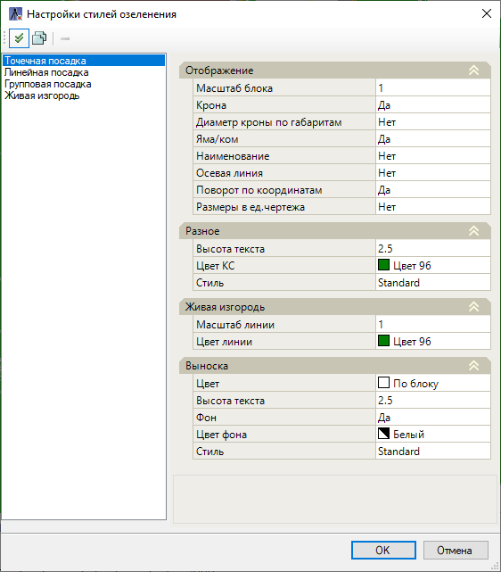

# Стили озеленения

Данные настройки задают параметры и свойства стилей озеленения, по значениям которых будут отображаться элементы Озеленения и выноски/ Настройки стилей имеют приоритет перед настройками **Свойств** элемента Озеленения.

Для редактирования стилей озеленения:

1. Выберите элемент меню **Озеленение - Общее - Стили озеленения**;

2. Откроется окно **Настройки стилей озеленения**. По умолчанию в программу добавлены системные стили озеленения: Точечная посадка, Линейная посадка, Групповая посадка, Живая изгородь.

В верхнем поле слева находятся пиктограммы настроек данного окна:

* При нажатии пиктограммы  выбранный стиль из списка назначается по умолчанию при создании элемента Озеленения.
* Пиктограмма  дублирует выбранный стиль.
* Пиктограмма  удаляет выбранный стиль, при этом удаление системного стиля заблокировано для пользователя.

В поле справа задаются **Свойства** для выбранного стиля озеленения:

* В разделе **Отображение** настраивается Масштаб блока кроны, отображение (Да/Нет) элементов Крона, Яма/ком, Диаметр кроны по габаритам, Осевая линия, Наименование, Размеры в ед. чертежа.
* В разделе **Разное** задается Высота текста (подписи элемента растения), Цвет корневой системы и Стиль подписи элемента растения.
* В разделе **Живая изгородь** настраиваются параметры Масштаб линии и Цвет линии условного обозначения Живой изгороди.
* В разделе **Выноска** настраиваются параметры Цвет, Высота текста, Фон, Цвет фона выноски выбранного стиля озеленения.

