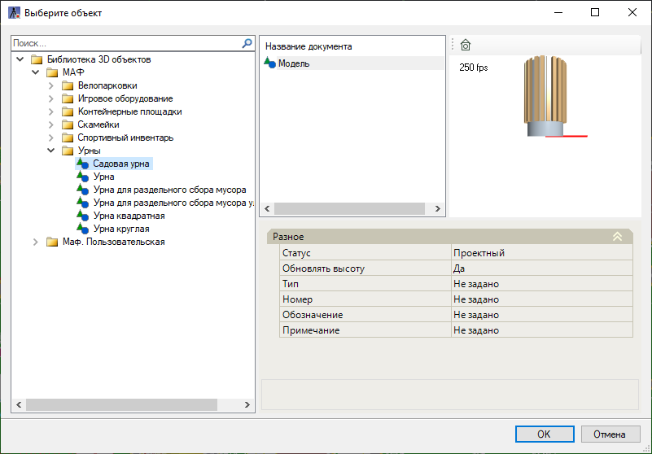
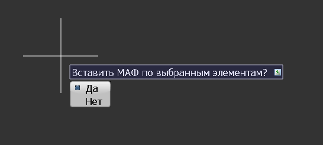

# Общее

В данном разделе справки будет описан принцип добавления элементов **МАФ**.

Для добавления МАФов:

1. Выберите элемент меню **МАФ - Общее - Вставить МАФ**;

2. Откроется окно **Библиотеки 3D моделей**:

3. Выберите из предложенного списка элементов необходимы объект и нажмите кнопку **ОК**. Последовательно укажите точки вставки элементов **МАФ**, для завершения функции нажмите кнопку **Enter**.



 Если перед вставкой МАФ был выбран линейный объект (полилиния, отрезок, структурная линия и т.д.), то после выбора объекта МАФ в библиотеке и нажатия ОК, программа предложит вариант расстановки МАФ по узловым точкам данного линейного объекта:  



