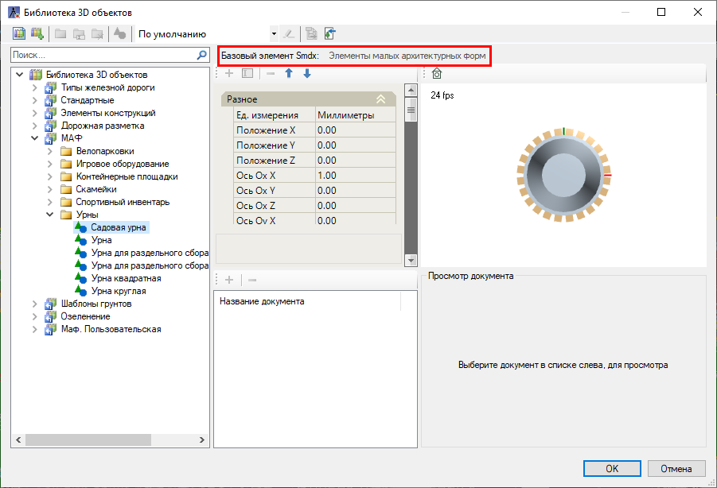

# Элементы МАФ в Библиотеке 3D объектов

В модуле Генеральные планы объектами **МАФ** являются объекты, у которых в **Библиотеке 3D моделей** в качестве **Базового элемента smdx** из библиотеки **Менеджер структуры smdx** назначен элемент ИМ **Элементы малых архитектурных форм**.



 Чтобы добавить пользовательский элемент МАФ, предварительно создайте пользовательскую библиотеку в **Библиотеке 3D моделей**. Общие принципы работы с библиотеками данных представлены в приложении [Приложение. Библиотеки данных](../../../../ru/annex/libraries/libraries_info.md).



