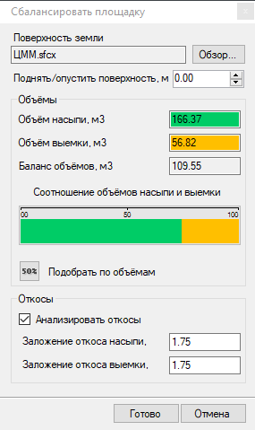

# Сбалансировать площадку

Данная функция позволяет графически отобразить соотношение объемов насыпи и выемки при расположении площадки на заданной высоте. Также имеется возможность автоматического определения оптимальной отметки площадки, при которой соотношение объемов насыпи и выемки будет одинаковым. Для этого:

1. Выберите элемент меню **Площадки - Утилиты - Сбалансировать площадку**;

2. Курсор примет форму прицела, левой кнопкой мыши укажите на плане исходный замкнутый контур, являющийся границей проектируемой площадки. Откроется диалоговое окно:

* **Поверхность земли** - в данном поле указывается наименование поверхности, относительно которой будут вычисляться объемы насыпи и выемки для устройства площадки. При необходимости расчетную поверхность можно изменить, воспользовавшись кнопкой **Обзор**.
* **Соотношение объемов насыпи и выемки** – соотношение объемов отображается графически разными цветами. Значения величин объемов насыпи и выемки также отображаются в соответствующих полях данного окна.
* **Подобрать по объемам** - данная функция позволяет определить такую высоту площадки, при которой значения объемов насыпи и выемки будут сбалансированы.
* **Поднять/опустить поверхность** - в данном поле можно задать изменение высотного значения площадки, а также определить его подбором с помощью соответствующих кнопок в виде стрелок вверх и вниз. Изменение высотного положения задается относительно существующего положения площадки.
* **Анализировать откосы** - если данная опция установлена, то с границ площадки будут строиться откосы до пересечения с поверхностью черной земли. Заложение откоса насыпи и выемки задается в соответствующих полях диалогового окна.

3. Для применения рассчитанной отметки площадки нажмите кнопку **Готово**.



1. Данная функция может быть использована как для первичного ориентировочного определения оптимальной отметки базовой точки плоскости площадки, так и ее окончательной посадки на рельеф, когда на площадке уже запроектированы все основные объекты (дорожные конструкции, газоны, здания и т.п.).
2. Если в свойствах элементов площадки были заданы толщины конструктивных слоев, то объем земляных работ будет вычисляться не до поверхности площадки, а до поверхности, опущенной на толщину конструктивных слоев площадки. Более подробно о создании поверхности по низу конструктивных элементов будет описано далее в разделе [Определение объемов основных работ](../../../ru/annex/archive_sections/create_areas/determination_main_volumes_works.md).
3. При определении объемов насыпи и выемки, учитываются объемы в пределах границы проектируемой площадки. Объемы работ в пределах проектных откосов в данной функции не учитываются. Сами откосы отображаются для наглядности только на время использования данной функции. Для создания откосов предусмотрена соответствующая функция, которая будет описана [далее](../../../ru/annex/archive_sections/create_areas/creating_slopes.md).



