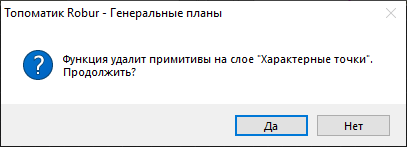
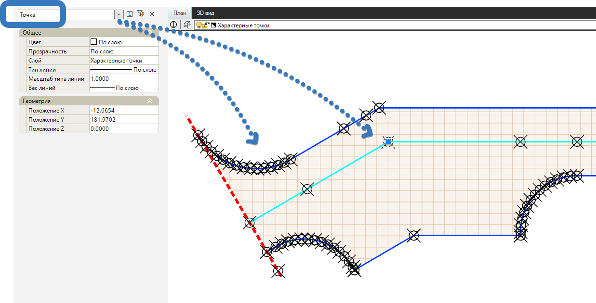

# Копировать точки из опорной поверхности

Данная функция предназначена для копирования из **Опорной поверхности** в текущую модель Площадка *рельефных точек* в виде *примитива точка*.



 1. Функция используется в рамках решения задачи по проецированию модели Площадка на [Опорную поверхность](project_onto_the_support_surface.md).

 2. **Опорная поверхность** задается в [Настройках модели Площадка](../creating_ground_model.md), которые были подробно описаны ранее. 2. Те точки **Опорной поверхности** поверхности, у которых в **Свойствах** стоит флаг **Ситуационная - Да** в модель Площадка не копируются.



Для этого:

1. Выберите элемент меню **Площадки - Утилиты - Копировать точки из опорной поверхности**. Программа отправит уведомление о том, что все примитивы, относящиеся к слою **Характерные точки**, будут удалены:

2. Нажмите кнопку **Да**. Программа перенесет рельефные точки поверхности из Опорной поверхности, как ситуационные точки (примитивы) в слой **Характерные точки**.



 1. После копирования Характерных точек, для их учета в поверхности текущей модели Площадка необходимо воспользоваться командой [Создать поверхность из примитивов](creating_surface_from_primitives.md) 
 
 2. Вид отображения точек может быть настроен, подробнее [см. раздел Дополнительные инструменты](../../../ru/install_startup/startup/working_with_layers_model/tool.md).



