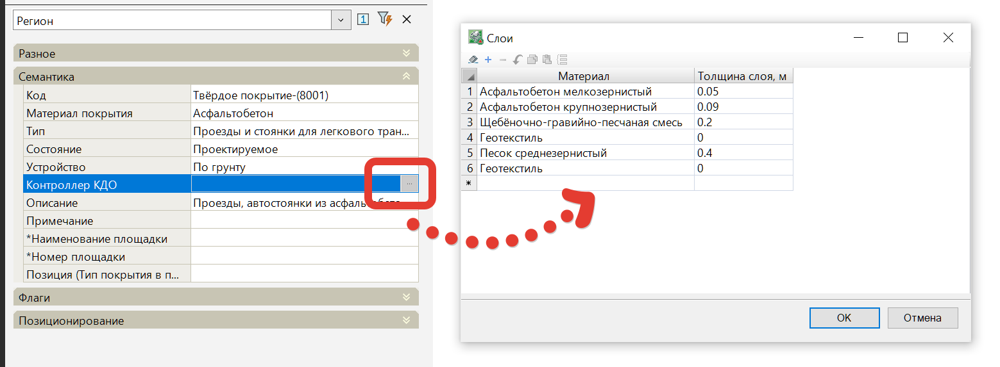

# Создать поверхность по низу конструкций

Для определения объемов работ между двумя поверхностями, при проектировании объектов генплана, в Robur предусмотрено построение картограмм по сетке квадратов.



Последовательность действий по созданию площадных картограмм описана далее (См. [Общие задачи, Создание площадных картограмм](../../../ru/commons_tasks/cartogram/create_cartogram.md)).



Объем земляных работ рассчитывается между двумя заданными поверхностями. Как правило, это поверхность проектной площадки (с учетом толщин конструкций ее элементов) и поверхность существующего рельефа. Для создания проектной поверхности площадки в программе предусмотрена специальная функция, позволяющая построить вспомогательную поверхность, если при подсчете земляных работ необходимо сделать поправку на толщину конструкций площадки (толщина слоев конструкции назначенная на участки). Для того чтобы сформировать данную поверхность:

1. Для участков твердых покрытий, озеленения и т.п. задайте соответствующую конструкцию дорожной одежды.

Сделать это можно либо через заполнение свойства **Контроллер КДО**, которое имеется у стандартных семантических объектов для твердых покрытий и озеленения:

Или при помощи Модификатор [Слои](../../genplan/vertical_layout_new/design_plan_genplan/layers.md)

2. Далее выберите элемент меню **Площадки** - **Утилиты** - **Создать поверхность по низу конструкций**;

3. Курсор примет форму прицела, левой кнопкой мыши укажите контур структурной линии, внутри которого будет создана поверхность, опущенная на заданную глубину конструкции слоев соответствующих участков. Если для какого-либо участка не назначены слои конструкции, то результирующая поверхность в таком месте будет совпадать с исходной;

4. В открывшимся диалоговом окне введите наименование создаваемой поверхности и нажмите **Ок**.

В результате, на основе поверхности по верху площадки и толщин всех ее элементов, будет создана новая “выдавленная” поверхность, построенная по низу конструкции всех ее элементов.

Далее полученную поверхность вы можете использовать в качестве проектной, при подсчете объемов земляных работ.



В случае изменения высотных отметок по верхней (проектной) поверхности площадки, нижнюю поверхность (используемую для подсчета объемов земляных работ) необходимо перестроить заново.



