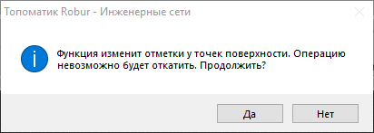

# Создать поверхность слияния

Функция позволяет в модели **Площадка** получить итоговую поверхность путем слияния моделей различного типа. Модели для слияния задаются в [Настройках модели Площадка](../creating_ground_model.md) на вкладке **Поверхности слияния**.

Для этого:

1. Выберите функцию меню **Площадки - Утилиты – Создать поверхность слияния**. Программа отправит уведомление о том, данная функция пересоздаст поверхность, то есть все элементы поверхности/примитивы будут удалены из модели **Площадка**:

2. Нажмите кнопку Да. В результате будет создана объединенная поверхность в модели **Площадка**.



 При внесении каких-либо изменении в одну из моделей, участвующих в слиянии, функцию **Создания поверхности слияния** необходимо выбрать снова.



