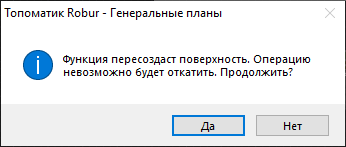
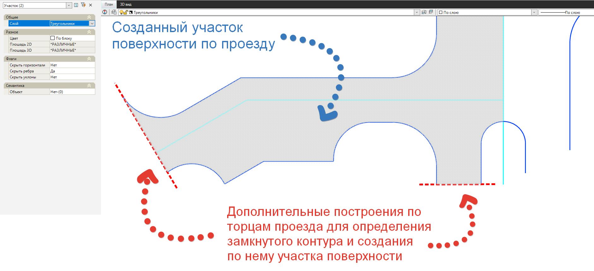

# Создать поверхность из примитивов

Данная функция позволяет создать структурные линии, полигоны, а также участки поверхности на основе эскиза [горизонтальной планировки](../../genplan/horizontal_layout_new/introduction.md) площадного объекта, который был сделан при помощи [базовых примитивов](../../../ru/rb_survey/dtm/dwg/types_primitives_drawing.md) (отрезки, полилинии, окружности и т.д.) и [динамических построений](../../genplan/horizontal_layout_new/dynamic_objects/axis_line.md).

Для этого:

1. Выберите элемент меню **Площадки - Утилиты - Создать поверхность из примитивов**. Программа отправит следующее уведомление, которое информирует о том, что поверхность будет пересоздана, соответственно, все ранее созданные элементы поверхности (точки поверхности, структурные линии, треугольники поверхности) **будут удалены**:

2. На основе замкнутых примитивов будут созданы полигоны (Структурные линии, Граничные полигоны) и участки (набор треугольников поверхности, объединенные между собой в единый объект). В вершинах примитивов будут автоматически созданы точки поверхности с высотной отметкой равной нулю.



 1. При работе команды **Создать поверхность из примитивов** анализируются только видимые объекты эскиза Горизонтальной планировки.

 2. Обязательным условием для построения структурных линий, граничных полигонов и участков поверхности является **замкнутость** отрисованных контуров Горизонтальной планировки 

 3. В случаях, когда в качестве базового примитива был использован дуговой сегмент, настройки точности разбивки дуговых сегментов задаются в [настройках модели Площадка](../creating_ground_model.md) в разделе **Общее** - **Максимальное отклонение от хорды, м**





 Для назначения семантических характеристик (Твердые покрытия, Застройка и т.д.) созданным участкам поверхности используйте модификатор [Регион](../../genplan/vertical_layout_new/design_plan_genplan/region.md).



