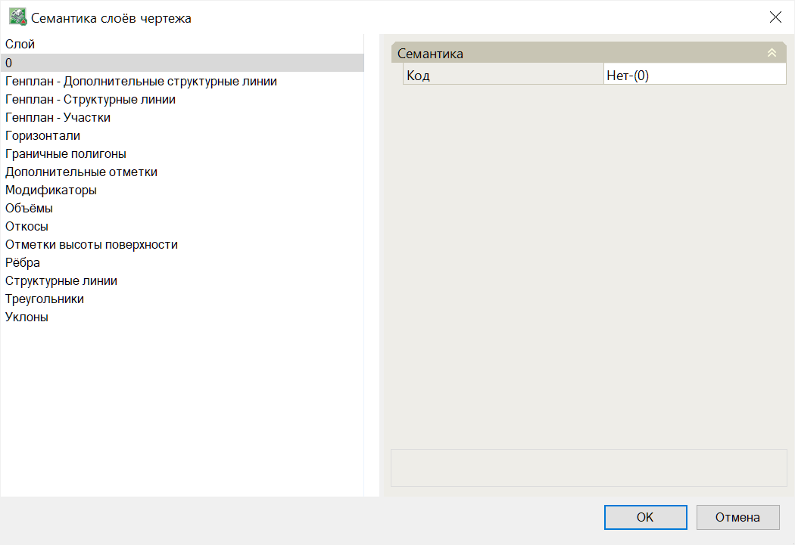
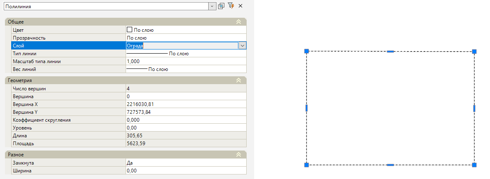
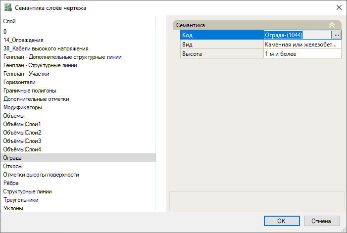
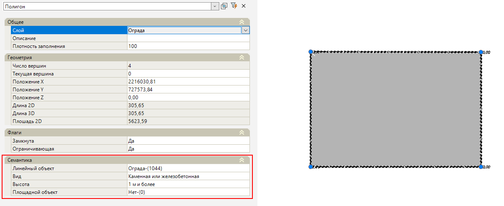

# Семантика слоев чертежа

Данная функция дает возможность автоматизировать назначение семантических свойств линейным объектам (структурным линиям и полигонам), которые в свою очередь создаются функцией [Создать поверхность из примитивов](creating_surface_from_primitives.md).

Таким образом, по отрисованным элементам Горизонтальной планировки автоматически создаются линейные объекты генерального плана, такие как бордюры, лотки, ограждения и т.д.

Для этого:

1. Выберите элемент меню **Площадки - Утилиты - Семантика слоев чертежа**. Откроется диалоговое окно **Семантики слоев чертежа**:



 Предварительно, нужные элементы Горизонтальной планировки (построения, отвечающие за линейные объекты) требуется разместить на отдельные слои. 



2. Выделив нужный слой в левой части окна, задайте ему Семантический объект в правой части окна, в поле Код, нажав кнопку "...".

3. В открывшемся окне Библиотеки, выберите нужный семантический код.



 Работа с Библиотекой семантических объектов подробно описана в ([Приложение. Библиотека семантических объектов](../../../ru/annex/library_semantics/semantics.md))



4. После назначения выбора объектов нажмите клавишу **ОК**.

5. Выберите функцию [Создать поверхность из примитивов](creating_surface_from_primitives.md)

В результате, все элементы Горизонтальной планировки, которые были расположены на соответствующих слоях, и которым в свою очередь были присвоены Семантические коды в окне Семантика слоев, будут преобразованы в Структурные линии с уже заданными параметрами.

