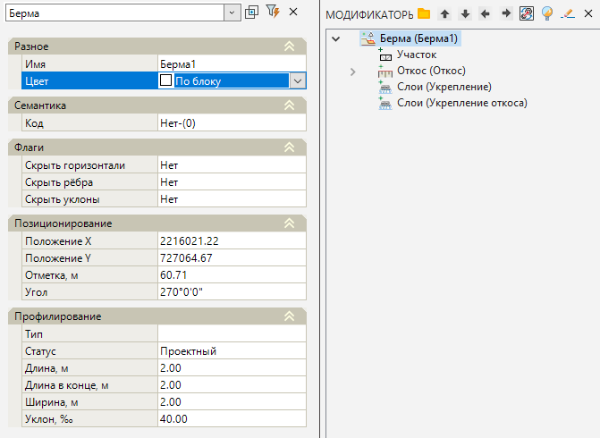
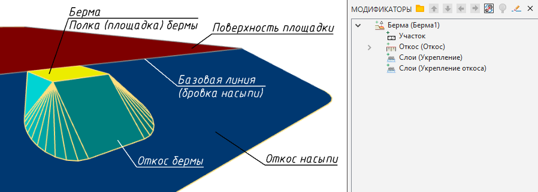

# Берма

Данная функция позволяет создать присыпную берму - площадку на откосе насыпи земляного полотна, которая формируется, например, для установки элементов обустройства автомобильной дороги.

Для этого:

1. Выберите элемент меню **Площадки** - **Модификаторы** - **Берма**;

2. Курсор примет форму прицела, укажите ЛКМ в окне **План** базовую линию (например, структурную линию по бровке насыпи), относительно которой будет создаваться берма.

3. Курсор будет перемещаться с привязкой к контуру, ЛКМ укажите положение точки вставки бермы.

4. Укажите сторону относительно базового линейного объекта, в которую будет строиться берма, нажав ЛКМ.

5. Выберите типовую берму из списка. Если ранее в **Менеджере структуры smdx** у элемента **Берма** был создан подтип, программа предложит выбрать данный шаблон с заданными параметрами.



 Функционал по **созданию пользовательских элементов информационной модели smdx** был описан ранее.



Если ранее не было создано пользовательского шаблона бермы, то программа пропустит данный пункт.

6. В строке динамического ввода укажите последовательно длину, ширину, поперечный уклон и заложение откоса создаваемой бермы и нажмите **Enter**. Откосы бермы будут опираться на ранее заданную поверхность ЦММ в настройках модели **Площадка**. Настройка исходных данных была описана в разделе [Создание и настройки модели площадки](../../../genplan/creating_ground_model.md).

7. Программа создаст берму относительно базового линейного объекта с заданными параметрами. В окне Модификаторы появится элемент **Берма** и набор вложенных элементов.

Для редактирования параметров созданной бермы необходимо открыть окно **Свойства** модификатора:

Базовые свойства **Модификаторов** (Имя, Цвет, Базовая линия, Код, Флаги) были описаны в разделе [Описание модификаторов](description_of_modifiers.md).

В области **Позиционирования**:

* **Положение X/Y, Отметка, м** - позволяет изменить положение базовой точки вставки бермы. Координаты базовой точки могут задаваться графически. Для этого выделите поле с соответствующей координатой (**X** или **Y**) и нажмите кнопку , курсор будет привязан к точке вставки объекта, укажите требуемое положение точки;
* **Угол** - позволяет изменить угол поворота базовой точки относительно оси Х. Угол поворота также можно задать визуально, для этого выделите поле и нажмите кнопку , определите сторону поворота и нажмите ЛКМ.

При выборе в окне **Модификатора** элемента **Берма** в окне План подсветится квадратный грип - базовая точка вставки бермы, которую можно перемещать независимо от ранее заданной базовой линии.

В области **Профилирования**:

* **Тип** - позволяет задать определенный шаблон бермы, параметры которого автоматически отобразятся в свойствах бермы. В строке ввода нажмите на кнопку . Откроется окно **Выбора типа smdx**. Если в **Менеджере структуры smdx** у элемента **Берма** ранее был создан подтип, программа предложит выбрать данный шаблон.



 Функционал по **созданию пользовательских элементов информационной модели smdx** был описан ранее.



* **Статус** - позволяет задать общий признак элемента **Берма**: Не определено, Существующий, Проектный, Демонтируемый, Демонтированный, Недействующий, Временный.
* В полях **Длина**, **Ширина** и **Уклон** есть возможность изменить первоначальные параметры данных величин.
* **Длина в конце** - позволяет изменить длину по бровке бермы. Например, преобразовать геометрическую форму полки бермы В трапецивидную.

Откос бермы в окне **Модификаторы** формируется, как вложенный элемент **Откос**, параметры которого (На всю линию, Сторонность, Заложение, Высота и т.д.) были описаны в разделе [Откос](slope.md).

В окне **Модификаторы** также формируются такие вложенные элементы, как **Слои**. Слои подразделяются на слои **Укрепления** площадки бермы и слои **Укрепления откосов** бермы, их параметры (Имя, Базовый участок, Слои) были описаны ранее в разделе [Слои](layers.md).

Для построения объемных тел слоев необходимо воспользоваться функцией [Перестроить твердотельную модель площадки](../../../genplan/utilities/rebuild_the_solidstate_model_of_the_platform.md).

# Пересчитать отметки берм

Данная функция позволяет пересчитать относительно базовой линии вертикальную отметку бермы при её изменении или при изменении положения базовой линии.

Для этого:

1. Выберите элемент меню **Площадки** - **Модификаторы** - **Пересчитать отметки берм**;

2. Курсор примет форму прицела, последовательно укажите ЛКМ в окне План бермы, отметки которых необходимо пересчитать.

3. Курсор примет форму прицела, укажите ЛКМ в окне План базовую линию (например, структурную линию по бровке насыпи), относительно которой будет пересчитана вертикальная отметка бермы. Предварительно необходимо проверить, что в модели, к которой принадлежит базовая линия, включен слой **Структурные линии**.

