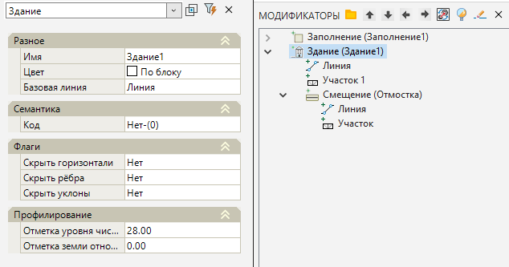
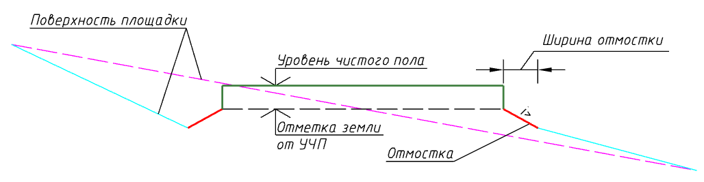
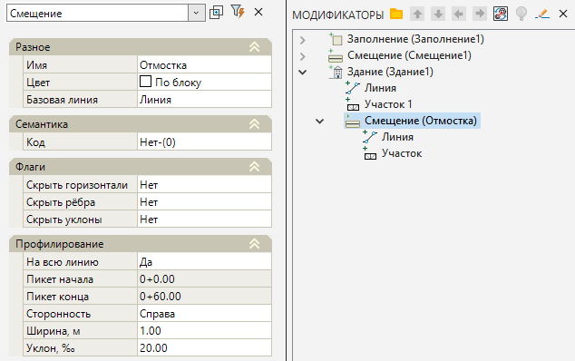

# Здание

Данный функционал позволяет вставлять на проектируемую поверхность элементы зданий, такие как отмостка и чистый пол, на основе проектных замкнутых контуров. Для этого:

1. Выберите элемент меню **Площадки – Модификаторы – Здание**.

2. Курсор примет форму прицела, укажите ЛКМ исходный замкнутый контур (полилиния, структурная линия) на плане, являющийся границей проектируемого здания.

3. Программа создаст отмостку и поверхность чистого пола здания в первом приближении. В окне **Модификаторы** появится элемент **Здание** и набор вложенных элементов.

Для редактирования параметров созданного модификатора необходимо открыть его окно **Свойств**:

В области **Профилирование**:

* **Отметка уровня чистого пола, м** – базовая отметка, относительно которой будут задаваться остальные элементы здания;

* **Отметка земли относительно УЧП, м** – расстояние до начала Смещения (Отмостки) здания относительно уровня чистого пола.

Базовые свойства Модификаторов (Имя, Цвет, Базовая линия, Код, Флаги) были описаны в разделе [Описание модификаторов](description_of_modifiers.md).

**Отмостка** здания автоматически формируется, как элемент **Смещение**, параметры которого (На всю линию, Сторонность, Ширина, Уклон) были описаны в разделе [Смещение](offset.md).

