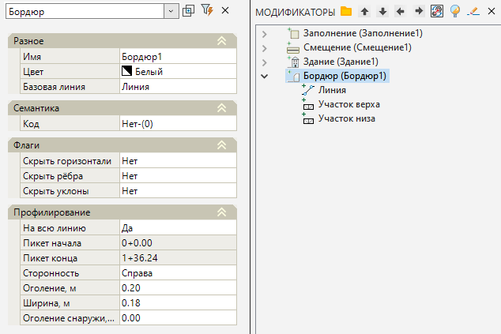

# Бордюр

Данная функция на основе исходного контура (полилиния, структурная линия) создает элемент Бордюр, использующийся, в основном, для решения задачи вертикальной планировки.

Для этого:

1. Выберите элемент меню **Площадки – Модификаторы – Бордюр**.

2. Курсор примет форму прицела, укажите ЛКМ на плане контур (структурную линию, полигон), на основе которого будет создан элемент.

3. ЛКМ укажите сторону, которая будет возвышаться относительно исходной линии.

3. В строке динамического ввода последовательно задайте оголение бордюра, его ширину и оголение снаружи.

4. Курсор снова примет форму прицела и будет перемещаться с привязкой к контуру, который был выбран ранее. ЛКМ последовательно укажите на исходном контуре начальную и конечную точку бордюра.



 Автоматически может быть выбран весь линейный объект, вдоль которого требуется запроектировать бордюр, для этого в меню выбора или в контекстном меню выберите **На всей линии**.

 



5. Программа создаст бордюр. В окне **Модификаторы** появится элемент **Бордюр**.

Для редактирования параметров созданного модификатора необходимо открыть его окно **Свойств**:

* **На всю линию** – данная опция позволяет строить бортовой камень вдоль всей выбранной базовой линии или на конкретном ее участке.
* **Пикет начала/конца** – поля для заполнения, в случае если бордюр проектируется на конкретном участке базовой линии.
* **Сторонность** – сторона возвышения бортового камня относительно направления базовой линии.
* **Оголение, м** – величина возвышения бортового камня относительно базовой линии, т.е. над поверхностью площадки.
* **Ширина, м** – в данном поле указывается ширина бортового камня.
* **Оголение снаружи, м** – величина оголения бортового камня над возвышающейся стороной.

Базовые свойства **Модификаторов** (Имя, Цвет, Базовая линия, Код, Флаги) были описаны в разделе [Описание модификаторов](description_of_modifiers.md).



Как *элемент проекта* генерального плана, бортовой камень, в зависимости от задачи, может быть создан несколькими способами. Например, бортовой камень может быть создан при помощи структурной линии, проходящей по отметкам верх бортового камня, на которую назначен семантический объект *"8003 Бордюр"*. В этом случае имеется возможность автоматически сформировать [Ведомость длин (расширенная)](../../../../ru/genplan/creating_output_statements_genplan.md) по шаблону *"Практика.Ведомость бордюров"*, а также получить *бордюр* в качестве [твердотельного элемента](../../../genplan/utilities/rebuild_the_solidstate_model_of_the_platform.md), для решения задач Информационного моделирования.



