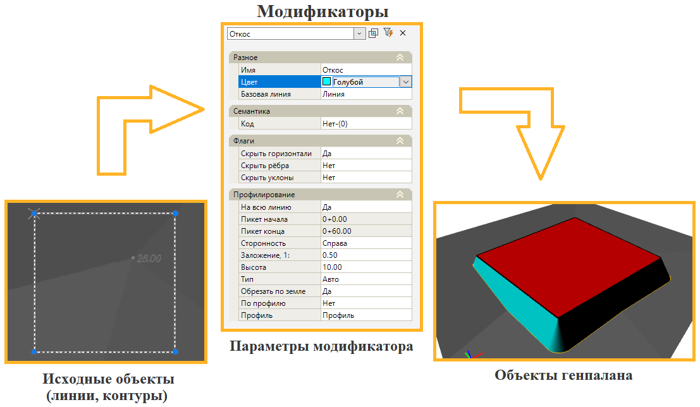
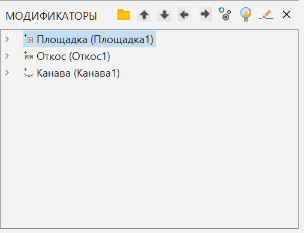
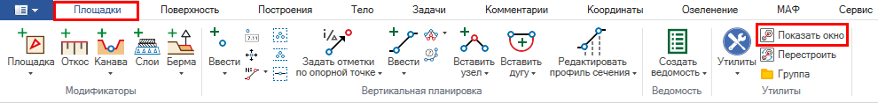
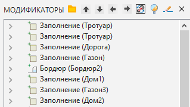
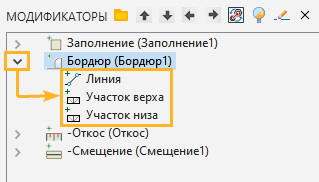
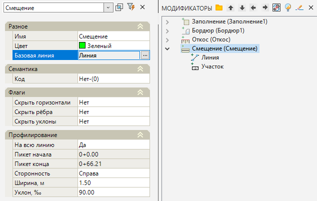

# Общие сведения

**Модификатор** представляет собой набор параметров, который назначается на выбранный исходный объект (структурная линия, участок поверхности и т.д.), в результате, в зависимости от типа **Модификатора** происходит, либо изменение свойств базового объекта, либо создание параметрического объекта генерального плана (Площадка, Откос, Канава и т.д.).

Общая схема работы **Модификторов** представлена ниже:

Все добавленные **Модификаторы** сохраняются в специализированном окне Модификаторы:

Это дает возможность изменить параметры созданного объекта (заложение откоса, высота оголения бортового камня и т.д.), а также автоматическое (взаимосвязанное) перестроения всех элементов генпалана на любом этапе проектирования в случаях изменения геометрии базового объекта или каких-либо исходных данных (изменились отметки поверхности земли, геометрия исходной линии и т.д.).

## Работа в окне Модификаторы

В данном разделе представлено описание общего функционала и принципов работы в окне **Модификаторы**.

Для того чтобы открыть окно **Модификаторы** во вкладке **Площадки** на ленте выберите элемент **Показать окно** или добавьте на одну из панелей активности окно **Модификаторы**.

После ввода любого модификатора он появится в окне **Модификаторы**. В верхней части окна находится следующий набор кнопок:

*  (**Перестроить**) – данная кнопка перестраивает площадной объект и пересчитывает модификаторы. Например, каждый элемент площадки имеет базовую линию вдоль или внутри которой строятся участки Модификаторов. Редактирование геометрии базовой линии ведет к изменениям, которые требуют перестроения (пересчета) модификаторов;
*  **(Переместить вверх/вниз)** – данные кнопки позволяют изменить положение элемента в окне Модификаторы.



 Построение\перестроение модификаторов производится по порядку сверху-вниз, таким образом важно соблюдать правильный порядок взаимосвязанных Модификаторов. Т.е. модификатор, у которого в качестве базовой линии выбрана линия, построенная другим модификатором, должен находиться в списке ниже этого модификатора. Например, модификатор Откос, у которого в качестве базовой линии выбрана линия полученная модификатором Площадка, должен находится по списку ниже. 



*  **(Удалить модификатор)** – данная кнопка предназначена для удаления выбранного модификатора.



 Следует помнить о том, что при удалении Модификатора, с которым связаны другие, будет нарушена их зависимость и построение таких элементов станет невозможным. В таком случае следует самостоятельно удалить зависимые Модификаторы или переназначить базовую линию; 



*  **(Группа)** – данная кнопка позволяет создать группу (папку) в окне **Модификаторы**, в которую можно перенести необходимые элементы модели для разделения и сортировки;
*  **(Переместить внутрь/наружу)** – данные кнопки позволяют переместить элементы модели в Группу/из Группы в окне **Модификаторы**;
*  **(Отключить/Включить модификатор)** – данная кнопка позволяет отключить/включить автоматическое перестроение модификатора. При проектировании элементов генплана и делении модификаторов по **Группам**, отключение целой Группы модификаторов позволяет ускорить процесс Перестроения модификаторов. При этом отключенные модификатор/**Группа** не будут удалены, а рядом с названием появится знак - .
*  **(Свернуть)** – данная кнопка закрывает окно **Модификаторы** на панели активности.

В основной части окна находятся все элементы, которые были добавлены в модель. Набор модификаторов представляет собой последовательную структуру, в которой к одним элементам могут прикрепляться другие, поочередно сверху вниз.

Слева от наименования модификатора находится кнопка  (**Развернуть**), нажав на которую отобразятся базовый линейный объект и участки, построенные модификатором.

При выборе линии или участка из окна **Модификаторы** они будут подсвечены в окне **План** и наоборот, при выборе в окне **План** какого-либо элемента будет раскрыт его модификатор.

## Свойства модификаторов

В данном разделе будут рассмотрены общие свойства Модификаторов и порядок их редактирования.

После ввода модификаторов может возникнуть необходимость в их редактировании. Нажав на наименование модификатора, в окне **Свойства** будут отображены его параметры доступные для редактирования.



 Редактировать параметры модификаторов необходимо именно в окне свойств самого модификатора, а не созданных им участков, поскольку при перестроении (пересчете) созданные модификатором участки будут пересчитаны и все внесенные изменения будут утрачены.



Рассмотрим свойства на примере модификатора **Смещение**:

Ниже рассмотрены параметры, которые присущи каждому элементу (исключением является модификатор слоев, свойства которого хранятся в таблице слоев):

* В поле **Имя** можно указать наименование элемента или его описание, для отображения в окне **Модификаторы**.
* **Цвет** отображения элемента в окне **План** назначается в соответствующем поле.
* **Базовая линия** – позволяет изменить выбранную ранее базовую линию или контур, по которому задан элемент.



 При переназначении у текущего Модификатора Базовой линии на Базовую линию от Модификатора, который добавлен после текущего, необходимо с помощью кнопок вверх\вниз изменить порядок Модификаторов в списке (подробнее см. Гл. Работа в окне Модификаторов).



* **Код** – в поле назначается дополнительная семантическая информация, например, для подсчета объемов и отображения модификатора на сводной информационной модели.
* **Флаги** – данный раздел свойств позволяет настроить видимость горизонталей/рёбер/уклонов выбранного модификатора.

Индивидуальные свойства каждого модификатора будут рассмотрены далее в соответствующих разделах.



 Также для просмотра и редактирования доступны свойства линий и участков, но, поскольку они являются результатом построения функции модификатора, то все внесенные изменения будут утеряны после следующего перестроения модификаторов. В окне свойств у таких элементов можно получить информацию об их длине или площади.



