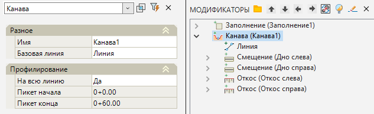
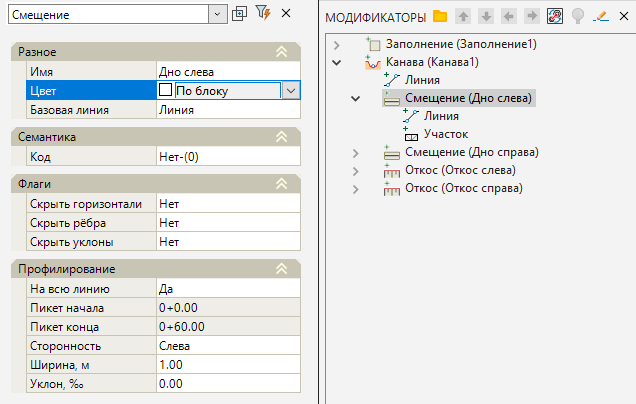
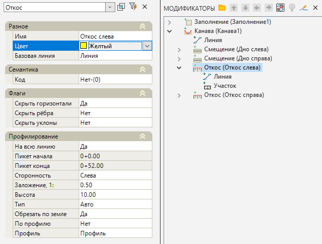
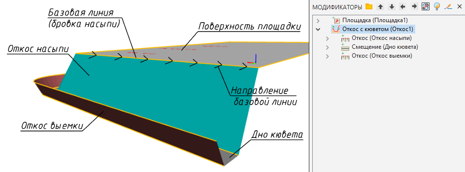
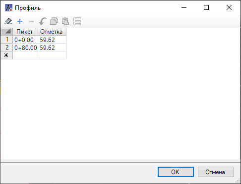
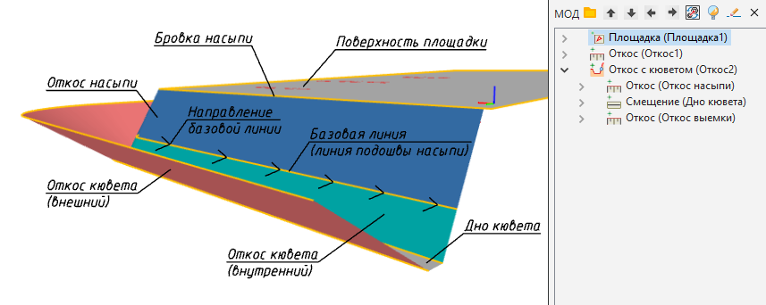
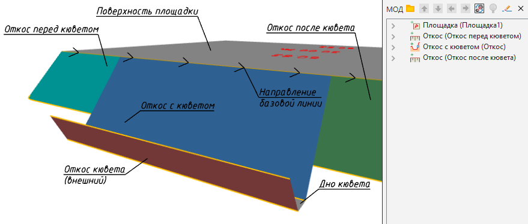
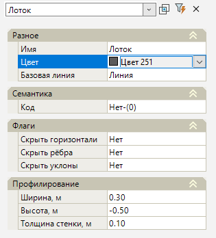
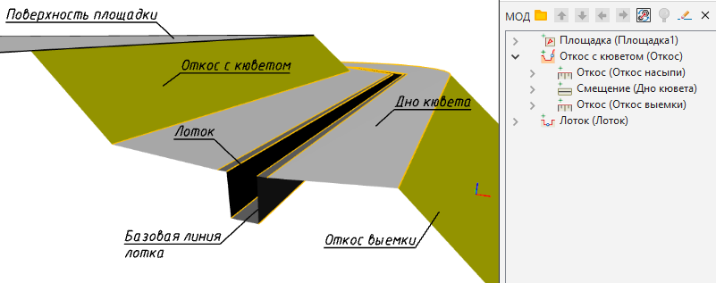

# Водоотвод в модели Площадка

В модели **Площадка** предусмотрен набор функций для проектирования системы водоотвода. Присутствует возможность проектирования канав вдоль откосов, а также независимо от положения площадок - вдоль базовых линий.

## Канава

Данная функция позволяет проектировать водоотводные канавы вдоль базовых линий (структурных линий, полилиний). Для создания канавы:

1. Выберите элемент меню **Площадки - Модификаторы - Канава**.

2. Курсор примет форму прицела, укажите ЛКМ в окне План базовую линию (структурная линия, полилиния), вдоль которой будет создаваться канава.

3. В строке динамического ввода последовательно задайте необходимую ширину дна проектируемой канавы и заложение откосов. Для подтверждения введенных значений нажмите **Enter**.

4. Программа создаст канаву по выбранному линейному объекту, в окне модификаторов также появится элемент **Канава** и набор вложенных элементов. Для редактирования созданного Модификатора доступны следующие параметры в окне **Свойства**:

* **На всю линию** – данная опция позволяет строить канаву вдоль всей выбранной базовой линии или на конкретном ее участке;
* **Пикет начала/конца** – поля активны для заполнения, в случае если канава проектируется на конкретном участке базовой линии;

Базовые свойства Модификаторов (Имя, Базовая линия) были описаны в разделе [Описание модификаторов](description_of_modifiers.md).

**Дно слева/справа** от базовой линии автоматически формируется, как элемент **Смещение**, параметры которого (На всю линию, Сторонность, Ширина, Уклон) были описаны в разделе [Смещение](offset.md).

**Откос слева/справа** от базовой линии автоматически формируется, как элемент **Откос**, параметры которого (На всю линию, Сторонность, Заложение, Высота и т.д.) были описаны в разделе [Откос](slope.md).

## Канава от бровки

Данная функция позволяет создавать откос с канавой вдоль базовых линий, являющихся бровкой площадки или подошвой откоса, и редактировать ее продольный профиль.

Для создания канавы от бровки:

1. Выберите элемент меню **Площадки** - **Модификаторы** – **Канава от бровки**;

2. Курсор примет форму прицела, укажите ЛКМ в окне базовую линию, вдоль которой будет создаваться откос с канвой;

3. Курсор снова примет форму прицела и будет перемещаться с привязкой к контуру, от которого будет строиться откос с канавой. Последовательно укажите ЛКМ на исходном контуре начальную и конечную точку или в контекстном меню выберите **На всей линии**.

4. Курсором укажите сторону, в которую должен быть отложен откос с кюветом;

5. В строке динамического ввода последовательно задайте заложение откоса и кювета, ширину дна и глубину проектируемой канавы. Для подтверждения введенных значений нажмите **Enter**.

6. Программа создаст элемент **Откос с кюветом**. В окне **Модификаторы** также появятся следующие вложенные элементы: Откос насыпи, Откос выемки и Дно кювета.



 Все эти элементы доступны для редактирования в окне **Свойства**. Параметры элементов Откосов были описаны ранее в разделе [Откос](slope.md).



 Для редактирования продольного профиля канавы необходимо в окне **Модификаторы** выбрать Откос насыпи. В окне **Свойства** выберите параметр **Профиль** и в строке ввода нажмите на кнопку . Редактирование профиля происходит в табличном виде.

Изначально в таблице находятся только крайние точки кювета. На профиль можно добавить дополнительные точки вставляя в таблицу дополнительные строки.

Заложение откосов канавы также редактируется в свойствах элементов откосов. Для этого в окне свойств одного из примыкающих откосов (3) откорректируйте значение параметра **Заложение**.

Параметр **Ширины** дна канавы находится в свойствах соответствующего элемента (2) в окне **Свойства**.



 Помимо стандартного откоса с помощью данной функции можно создавать канавы от линий подошвы насыпи, таким образом, что откос насыпи и откос выемки канавы будут иметь различное заложение:



## Канава к откосу

Данная функция позволяет встраивать элемент откоса с канавой в уже созданный откос насыпи.

Для создания канавы к откосу:

1. Выберите элемент меню **Площадки** - **Модификаторы** – **Канава к откосу**.

2. Курсор примет форму прицела, укажите ЛКМ в окне **План** откос, вдоль которого будет создаваться канава.

3. Курсор снова примет форму прицела и будет перемещаться с привязкой к контуру, от которого будет строиться откос с канавой. Последовательно укажите ЛКМ на исходном контуре начальную и конечную точку канавы.

4. В строке динамического ввода последовательно задайте необходимую глубину проектируемой канавы и ширину дна. Для подтверждения введенных значений нажмите **Enter**.

5. Программа создаст канаву по выбранному откосу. В окне **Модификаторы** появятся элементы канавы по откосу и набор вложенных элементов. Существующий откос будет разделен на 3 части:

1. Элемент откоса перед кюветом;
2. Элементы откоса с кюветом: откос насыпи, дно кювета, откос выемки;
3. Элемент откоса после кювета.

Редактирование созданных элементов описано выше в разделе **Канава от бровки**.

## Лоток

Данная функция позволяет проектировать лотки вдоль базовых линий (структурных линий, полилиний).

Для создания лотка:

1. Выберите элемент меню **Площадки** - **Модификаторы** – **Лоток**.

2. Курсор примет форму прицела, укажите ЛКМ в окне План базовую линию (структурная линия, полилиния), вдоль которой будет создаваться лоток.

3. В строке динамического ввода последовательно задайте необходимую ширину дна лотка, высоту лотка и толщину стенок. Для подтверждения введенных значений нажмите **Enter**.

4. Программа создаст лоток по выбранному линейному объекту, в окне модификаторов также появится элемент **Лоток**. Для редактирования созданного Модификатора доступны следующие параметры в окне **Свойства**:

* **Ширина** -в данном поле присутствует возможность задать ширину дна лотка.
* **Высота** -в данном поле присутствует возможность задать высоту боковых стенок лотка.
* **Толщина стенки** – данная опция позволяет задать толщину стенок лотка.

Базовые свойства **Модификаторов** (Имя, Базовая линия, Код, Флаги) были описаны в разделе [Описание модификаторов](description_of_modifiers.md).

