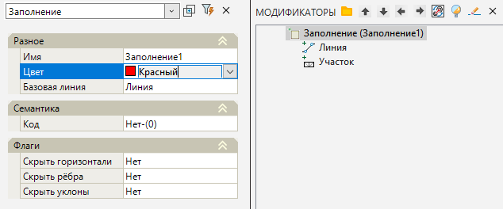

# Заполнение

Данная функция позволяет создавать участки внутри выбранных замкнутых контуров. К примеру, это позволяет быстро создавать на исходной поверхности площадки новые элементы (газоны, тротуары и т.п.) или саму поверхность площадки.

Для этого:

1. Выберите элемент меню **Площадки - Модификаторы - Заполнение**;

2. Курсор примет форму прицела, укажите ЛКМ на плане исходный замкнутый контур (полилиния, структурная линия), являющийся границей проектируемого участка.

3. Программа создаст участок заполнения. В окне **Модификаторы** появится элемент **Заполнение**.

Для редактирования параметров созданного модификатора **Заполнение** необходимо открыть окно **Свойства** модификатора. У данного элемента доступно редактирование базовых свойств Модификаторов (Имя, Цвет, Базовая линия, Код, Флаги), которые были описаны в разделе [Описание модификаторов](description_of_modifiers.md).

