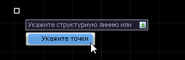
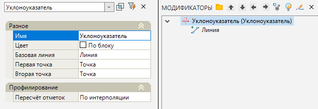

# Уклоноуказатель

Данная функция позволяет создать *динамические связи* между опорными точками поверхности и рассчитывать их отметки и отметки всех промежуточных точек по заданным параметрам, например **Уклону** или **Превышению**.

Основное преимущество **Уклоноуказателя** заключается в том, что при необходимости отметки опорных точек и сами параметры Уклоноуказателя могут в любой момент времени быть изменены, при этом все связные Уклоноуказателями опорные и промежуточные точки будут автоматически пересчитаны с учетом сделанных изменений.

Для добавления Уклоноуказателя:

1. Выберите элемент меню **Площадки - Модификаторы - Уклоноуказатель**;

2. Курсор примет форум прицела, укажите ЛКМ на плане структурную линию. Далее укажите ЛКМ первую и вторую опорные точки, между которым необходимо рассчитать значение уклона.



 Опционально элемент **Уклоноуказатель** может быть добавлен путем указания опорных точек через контекстное меню. Структурная линия между опорными точками будет создана автоматически.

  



3. Программа создаст элемент Уклоноуказатель. В окне **Модификаторы** появится элемент **Уклоноуказатель**.

Для редактирования параметров созданного модификатора **Уклоноуказатель** необходимо открыть окно **Свойства** модификатора:

Раздел **Разное**:

Базовые свойства Модификаторов (Имя, Цвет, Базовая линия) были описаны в разделе [Описание модификаторов](description_of_modifiers.md).

* **Первая/Вторая точка** - позволяет изменить выбранные ранее опорные точки, между которыми рассчитывается значение уклона.

В области **Профилирования**:

* **Пересчет отметок** - параметр, определяющий метод пересчета отметок:

Параметр **По интерполяции** выбирается для расчета уклона между двумя опорными точками и пересчета всех отметок промежуточных точек.

Параметр **Уклон** выбирается для обеспечения необходимого значения уклона между двумя точками, отметка второй опорной точки и всех промежуточных точек, находящихся в диапазоне - будут пересчитаны относительно первой опорной точки и заданного значения уклона.

Параметр **По превышению** выбирается для обеспечения необходимого значения превышения между двумя точками, отметка второй опорной точки и всех промежуточных точек, находящихся в диапазоне - будут пересчитаны относительно первой опорной точки и заданного значения превышения.

