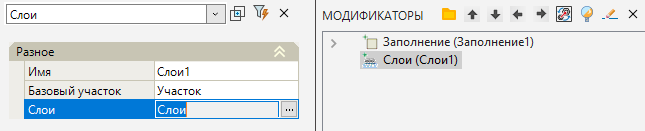
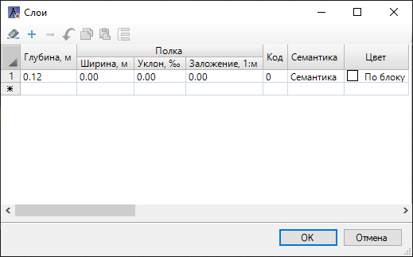
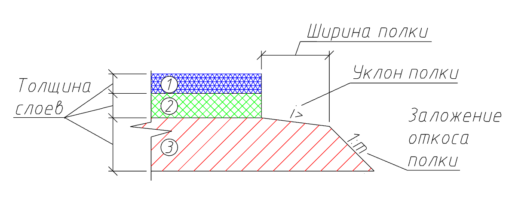
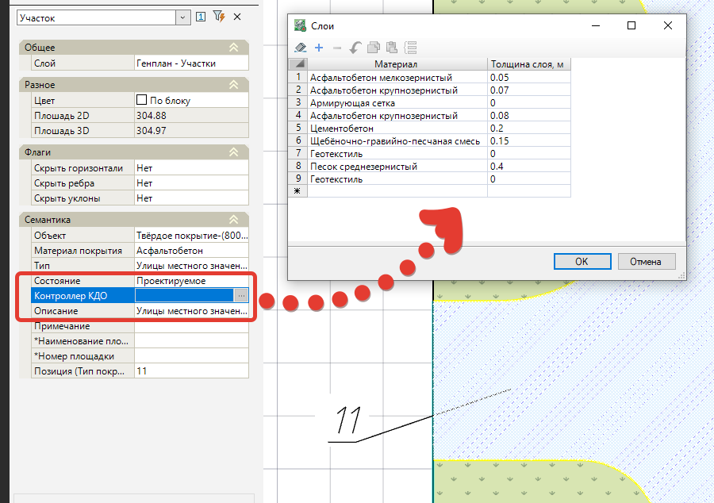

# Слои

Функция предназначена для назначения конструкций участкам площадок. Предусмотрен табличный редактор слоев конструкций. Впоследствии эти данные могут использоваться для вычисления объемов земляных работ с поправкой на конструкцию объектов площадки.

Для этого:

1. Выберите элемент меню **Площадки - Модификаторы – Слои**;

2. Курсор примет форму прицела, укажите ЛКМ в окне **План** участок, по которому будут назначены конструктивные слои.

3. В строке динамического ввода укажите толщину первого слоя конструкции площадки и нажмите **Enter**.

4. Программа создаст слой конструкции под выбранным участком, в окне модификаторов также появится элемент **Слои**.

* В поле **Имя** можно указать наименование элемента Слой или его описание, для отображения в окне **Модификаторы**.
* **Базовый участок** – позволяет изменить выбранный ранее базовый участок, по которому задан элемент Слой.

Для редактирования конструкции выберите в окне **Модификаторы** элемент конструкции участка **Слои**. В окне **Свойства** выберите параметр **Слои** и в строке ввода нажмите на кнопку . Откроется окно слоев конструкции:

В табличном редакторе реализована возможность составления многослойных конструкций участков площадок. Для того чтобы добавить слой необходимо добавить строку нажав на клавишу .

Для редактирования доступны: параметры **толщины** (глубины) слоев; настройка **полки** слоя, в том числе ее **ширина**, **уклон** и **заложение откоса**; присвоение **семантического кода** и выбор **цвета** отображения:

Каждому слою можно задать семантическую информацию при назначении **Кода** (в **Библиотеке семантических объектов** раздел **Шифр объемов**). Через параметр **Семантика** можно задать дополнительные атрибутивные данные по выбранному **Коду**.



 Работа с Библиотекой семантических объектов подробно описана в ([Приложение. Библиотека семантических объектов](../../../../ru/annex/library_semantics/object_codifier.md)).



Заданная атрибутивная информация будет учитываться при подсчете объемов и при отображении модификатора на сводной информационной модели.

Для построения объемных тел слоев необходимо воспользоваться функцией [Перестроить твердотельную модель площадки](../../../genplan/utilities/rebuild_the_solidstate_model_of_the_platform.md).



 Способ создания КДО (конструкции дорожной одежды) через модификатор **Слои** является одним из вариантов и позволяет детально задать параметры каждого слоя, включая толщину слоя, заложение и ширину полки. Второй способ задания КДО - это свойство **Контроллер КДО**, которое имеется у таких семантических объектов как *"8001 Твердые покрытия"* и *"8002 Озеленение"* и по умолчанию уже заполнено: 

 При этом имеется возможность редактирования этих данных, т.е. изменение параметров КДО для выбранного участка, изменение параметров КДО по умолчанию ([Менеджер структуры семантики](../../../../ru/annex/library_semantics/object_codifier.md)), а также добавление пользовательских материалов (Менеджер структуры SMDX).



