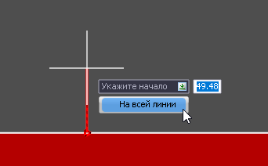
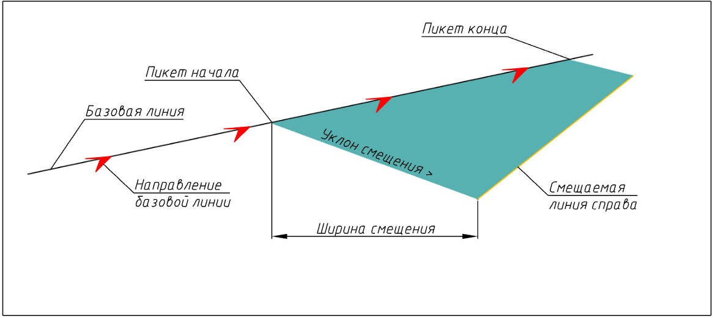
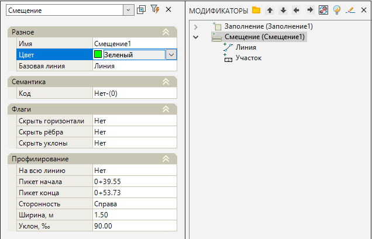

# Смещение

Данная функция позволяет относительно выбранной линии создать участок поверхности с заданными параметрами, шириной и уклоном (или превышением). Это позволяет легко моделировать такие элементы как обочины, дорожки, тротуары и т.п.

Для того, чтобы создать участок смещения:

1. Выберите элемент меню **Площадки – Модификаторы – Смещение**.

2. Курсор примет форму прицела, укажите ЛКМ в окне **План** линейный объект (полигон, структурная линия), относительно которого будет создаваться участок смещения.

3. Курсор будет перемещаться с привязкой к контуру, ЛКМ последовательно укажите на исходном контуре начальную и конечную точку участка смещения. Также для правильного определения положения участка на замкнутом контуре необходимо указать произвольную промежуточную точку внутри границ выбранного участка.



 втоматически может быть выбран весь линейный объект, вдоль которого требуется запроектировать смещение, для этого в меню выбора или в контекстном меню выберите **На всей линии**.

 



4. Укажите сторону относительно базового линейного объекта, в которую будет откладываться участок смещения, нажав ЛКМ.

5. В строке динамического ввода укажите последовательно ширину и уклон/разность отметок создаваемого участка и нажмите **Enter**.

6. Программа создаст участок смещения относительно базового линейного объекта с заданными параметрами. В окне **Модификаторы** появится элемент **Смещение**.

Для редактирования параметров созданного смещения необходимо открыть окно **Свойства** модификатора:

* **На всю линию** - опция позволяет расположить участок смещения вдоль всей линии или на ее определенном участке. Границы расположения участка изменяются в полях Пикет начала/конца.
* **Сторонность** - указывает с какой стороны относительно направления линейного объекта необходимо создавать участок.
* В полях **Ширина** и **Уклон** есть возможность изменить первоначальные параметры данных величин.

Базовые свойства **Модификаторов** (Имя, Цвет, Базовая линия, Код, Флаги) были описаны в разделе [Описание модификаторов](description_of_modifiers.md).

