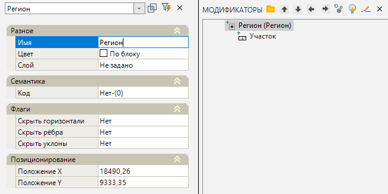

# Регион

Данная функция дает возможность автоматизировать назначение семантических свойств на участки поверхности, при этом не теряя этих назначенных параметров даже при перестроении участков поверхности.



 Участки поверхности могут быть предварительно созданы как при помощи [данного функционала](../../../../ru/rb_survey/dtm/sfc/patches/notion_of_parcels.md), так и при помощи [соответствующей команды](../../../genplan/utilities/creating_surface_from_primitives.md).



Для этого:

1. Выберите элемент меню **Площадки - Модификаторы - Регион**;

2. Программа предложит указать на Плане точку вставки Региона, укажите ЛКМ на участок поверхности.

3. Программа создаст Регион (точку) в указанном месте. В окне **Модификаторы** появится элемент **Регион**.



 Инструмент **Регион** представляет собой точку с заданными параметрами семантики, которые автоматически передаются на участок поверхности, в пределах которого этот **Регион** находится.

Для ускорения процесса работы можно копировать элемент **Регион** (Копирование с базовой точкой - сочетание клавиш CTRL + SHIFT + C) и вставлять на другие участки (Вставка - сочетание клавиш CTRL + V). 



 Для редактирования параметров созданного модификатора **Регион** необходимо открыть окно **Свойства** модификатора. У данного элемента доступно редактирование базовых свойств Модификаторов (Имя, Цвет, Слой, Код, Флаги), которые были описаны в разделе [Описание модификаторов](description_of_modifiers.md).

