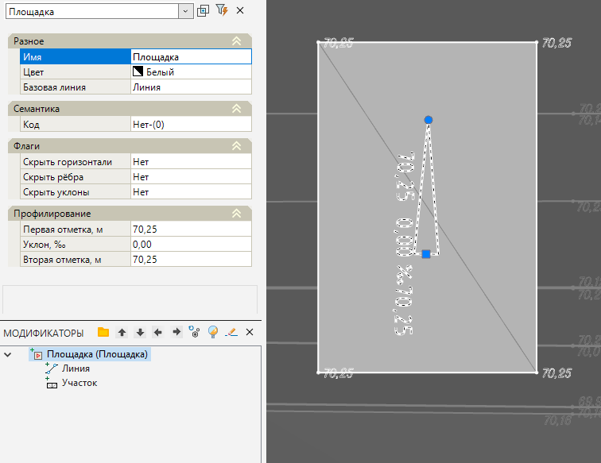
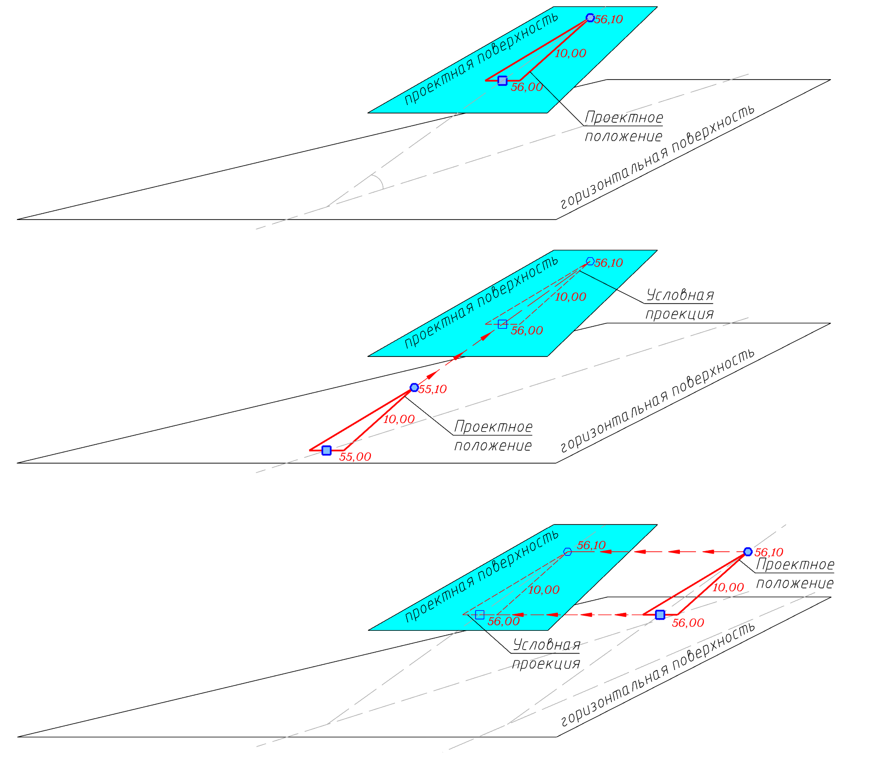
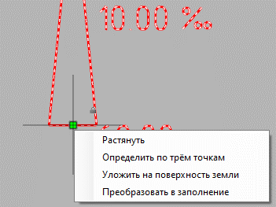

# Площадка

Функция предназначена для создания участка поверхности на основе исходного замкнутого контура, а также определения положения этого участка поверхности в пространстве по различным параметрам и критериям (по двум точкам и уклону, по трем точкам и т.д.).

Модификатор **Площадка** может использоваться как для определения положения локального участка генерального плана (например участок игровой площадки, планировка под здание и т.д.), а также в случае, когда необходимо задать первое приближение или генеральный уклон всего площадного объекта с учетом оптимального расположения, например по соотношению объемов Насыпи и Выемки.

Для этого:

1. Выберите элемент меню **Задачи - Площадки - Площадка**;

2. Курсор примет форму прицела, укажите ЛКМ на плане исходный замкнутый контур (полилиния, структурная линия, полигон), являющийся границей проектируемой площадки (или участка).



 Если в качестве базового контура выбирается полилиния, то по ней будет создана структурная линия (полигон), отметки в вершинах которой примут значение равное средней отметке земли по площади контура.

Если базовый контур представлен структурной линией, то отметки в узлах также поменяют свои значения на среднюю отметку земли по площади контура. 



3. Программа создаст горизонтальную поверхность площадки (участок поверхности) в первом приближении. Внутри контура площадки появится условный знак генерального уклона. В окне **Модификаторы** появится элемент **Площадка**.

Редактирование проектной поверхности производится через окно **Свойств** данного **Модификатора**. Для этого доступны следующие параметры:

* **Первая отметка**, **Вторая отметка** – высотное значение двух точек, определяющих ориентацию плоскости площадки.
* **Уклон** - в данном поле задается уклон между первой и второй базовой точкой плоскости площадки. Отметка первой точки остается неизменной, а вторая отметка будет пересчитана.



 Ориентирование площадки с помощью двух отметок и уклона возможно двумя способами:

 1. Задание первой и второй точки, в таком случае в поле Уклон значение будет вычислено автоматически;
 2. Задание отметки первой точки и уклона, в таком случае в поле Вторая отметка значение будет вычислено автоматически.



Базовые свойства Модификаторов (Имя, Цвет, Базовая линия, Код) были описаны в разделе [Описание модификаторов](description_of_modifiers.md).

На условном знаке уклона площадки отображены отметки точек и уклон между ними. На плане эти точки отображены в виде грипов синего цвета. Направление уклона всегда показано от первой точки, с квадратным грипом, ко второй, с круглым грипом, значение уклона может быть положительным, либо отрицательным. По умолчанию первая точка находится в геометрическом центре контура, уклон задан нулевым, расстояние между точками 10 метров и отметка площадки вычисляется автоматически как средняя, на основе данных о поверхности земли внутри контура.



 Базовым контуром для создания площадки может служить любой замкнутый контур, но вне зависимости от исходного вертикального положения проектная поверхность будет создана с нулевым уклоном и средней отметкой, вычисленной по поверхности земли внутри контура.



Положение условного знака уклона может быть произвольным. Т. е. он может располагаться как в пределах площадки, так и вне ее, например, на поверхности другой площадки или поверхности автомобильной дороги. В случае если условный знак находится за пределами базового контура, вычисление отметок площадки будет экстраполировано согласно отметкам и углу между ними.

Для ориентирования проектной поверхности имеются дополнительные команды, вызвать которые можно через контекстное меню нажав ПКМ на грипе первой точки:

* **Растянуть** – команда активирует режим перемещения условного знака генерального уклона за первую точку.
* **Определить по трем точкам** – положение плоскости площадки однозначно может быть определено по трем заданным точкам поверхности. Эти точки также могут располагаться за пределами площадки и принадлежать различным моделям, например поверхности рельефа и проектной поверхности дороги.
* **Уложить на поверхность земли** – данная функция позволяет автоматически сориентировать плоскость площадки по рельефу таким образом, чтобы отклонение их отметок было минимальным.



 Для того чтобы самостоятельно сориентировать проектную поверхность необходимо задать направление уклона условного знака перемещая грип второй точки и ввести значения отметок и уклона в окне Свойства модификатора. 



* **Преобразовать в заполнение** – функция позволяет преобразовать модификатор **Площадка** в модификатор **Заполнение**. Данная функция необходима для того, чтобы была возможность детально корректировать вертикальную планировку проектного контура.



 Так как модификатор **Площадка** при перестроении всегда будет определять положение участка поверхности и отметки самого базового контура по заданным параметрам модификатора (Отметка и Уклон), то все "ручные" изменения отметок проектного контура после перестроения модификатора будут теряться. Поэтому, при необходимости детальной проработки модификатор Площадка необходимо преобразовать в Заполнение (см. выше).



Более подробно о модификаторе **Заполнение** будет описано в следующем разделе.

