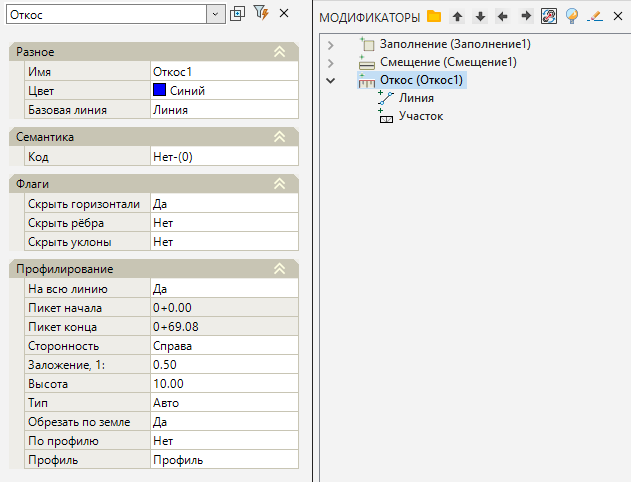
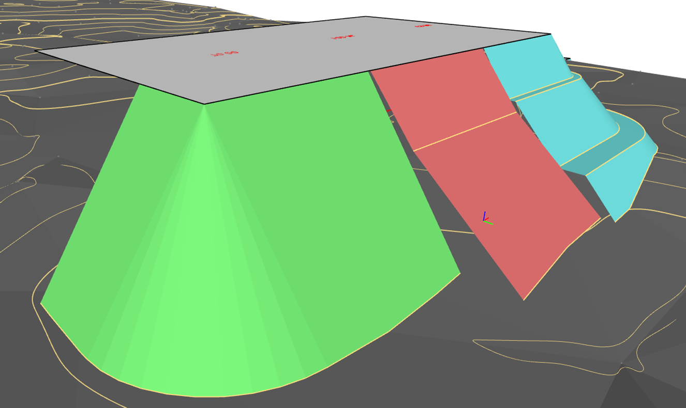

# Откос

Данная функция позволяет строить откосы от заданного контура (преимущественно им является граница проектируемой площадки) до поверхности существующего рельефа, до заданной высоты и по профилю.

Для создания откоса:

1. Выберите элемент меню **Площадки - Модификаторы - Откос**.

2. Курсор примет форму прицела, укажите ЛКМ на плане контур (структурную линию, полигон), вдоль которого будет создаваться откос.

3. Курсор снова примет форму прицела и будет перемещаться с привязкой к контуру, который был выбран ранее. ЛКМ последовательно укажите на исходном контуре начальную и конечную точку откоса. Также для правильного определения положения участка на замкнутом контуре необходимо указать произвольную промежуточную точку внутри границ откоса.



 Автоматически может быть выбран весь линейный объект, вдоль которого требуется запроектировать откос, для этого в меню выбора или в контекстном меню выберите **На всей линии**.



4. Укажите на экране сторону отрисовки откоса. Затем в строке динамического ввода укажите заложение откосов площадки и нажмите **Enter**.

5. Программа построит откос в соответствии с заданными параметрами. В окне **Модификаторы** появится элемент **Откос**.

Для редактирования созданного Модификатора доступны следующие параметры в окне **Свойства**:

* **На всю линию** – данная опция позволяет строить откос площадки вдоль всей выбранной базовой линии или на конкретном ее участке.
* **Пикет начала/конца** – поля для заполнения, в случае если откос проектируется на конкретном участке базовой линии. Также положение откоса по контуру можно изменить растягиванием его за грипы.
* **Сторонность** – данная опция позволяет изменить сторону построения откоса относительно исходного контура.
* В поле **Заложение откоса** указывается его величина также доступная для редактирования.
* **Высота** -в данном поле присутствует возможность задать высоту проектируемого откоса от бровки.
* **Тип** – данная опция отвечает за направление откоса. При включенном режим **Авто** откос откладывается к поверхности земли. При режиме **Насыпь** и **Выемка** откос откладывается соответственно вниз и вверх вне зависимости от положения площадки относительно черной земли.



 С помощью опции **Высота** и модификаторов **Смещения** есть возможность строить составные многоступенчатые откосы и бермы на них.



* **Обрезать по земле** – данная опция при значении **Да** обрезает откос в месте пересечения с землей. В случае если установлено значение **Нет**, то программа построит откос в соответствии со значением указанным в поле **Высота**.
* **По профилю** – при значении параметра **Да** профиль подошвы откоса будет построен в соответствии с таблицей профиля. При значении **Нет** построение откоса будет происходить в соответствии со значениями опций **Обрезать по земле** и **Высота**. Перейти в таблицу профиля можно через поле опции **Профиль**, нажав на кнопку . Данная опция в основном предназначена для проектирования продольного профиля кюветом, поэтому по умолчанию она отключена при построении откоса. Более подробное о работе с таблицей профиля будет описано ниже.

Базовые свойства **Модификаторов** (Имя, Цвет, Базовая линия, Код, Флаги) были описаны в разделе [Описание модификаторов](description_of_modifiers.md).

