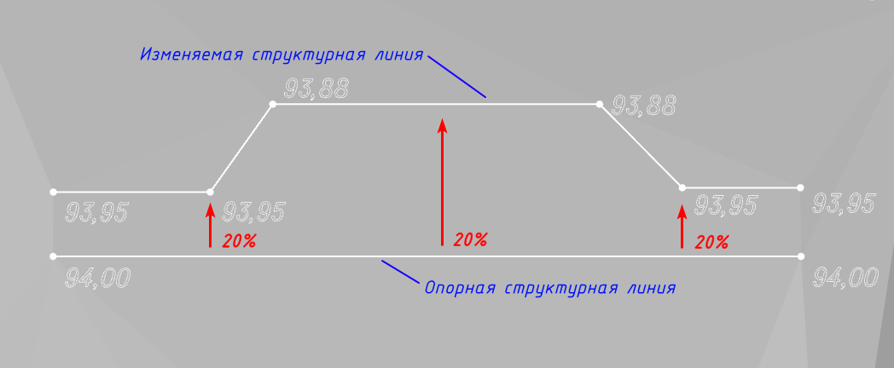

# Задать отметки по опорной линии

Данная функция позволяет изменить высотные отметки структурной линии относительно опорной структурной линии согласно заданному уклону или превышению.

Для этого:

1. Выберите меню **Площадка – Точки – Задать отметки по опорной линии**;

2. Укажите **Уклон** или **Превышение** относительно базовой точки. Для подтверждения ввода нажмите **Enter**;

3. Укажите левой кнопкой мыши базовую структурную линию;

4. Укажите изменяемую структурную линию. Таким образом отметки изменяемой структурной линии пересчитаются согласно заданному превышению или уклону. Для завершения функции нажмите **Esc**.



 При этом опорная структурная линия и редактируемая структурная линия должны быть **Ограничивающими** и участвующими в построении поверхности. 



