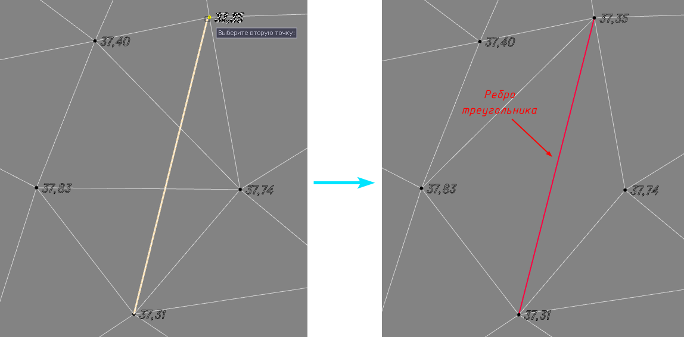

# Добавить ребро

Для того, чтобы изменить триангуляцию на участке поверхности, воспользуйтесь функцией:

1. Меню **Площадки - Структурные линии – Добавить ребро**;

2. Курсор примет форму прицела, укажите левой кнопкой мыши первую точку, далее укажите вторую точку. Обратите внимание, что вторая точка должна лежать на ребре треугольника или за его пределами, для того, чтобы ребро было создано автоматически.

В результате между этими точками будет создана ограничивающая структурная линия (а соответственно и ребро поверхности), которая изменит триангуляцию на участке соответствующим образом. 

