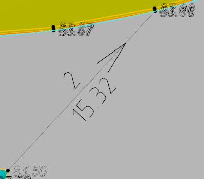

# Назначить уклоноуказатель

Функция предназначена для отрисовки условного знака уклоноуказателя между двумя выбранными точками. Для этого:

1. Выберите элемент меню **Площадка – Структурные линии – Назначить уклоноуказатель**;

2. Укажите на поверхности левой кнопкой мыши начальную и конечную точку для построения уклоноуказателя. В результате между этими точками будет создан линейный объект (структурная линия), отрисованный соответствующим условный знаком:

Определенные параметры созданного уклоноуказателя можно изменить с помощью окна свойств выбранного объекта.



 Важная особенность данного объекта Уклоноуказатель: При добавлении Уклоноуказателя, создается две точки поверхности (если Уклоноуказатель добавлялся без привязки к уже имеющимся точкам) и структурная линии, в связи с этим, после ввода Уклоноуказателя в месте его добавления, может произойти частичное перестроение триангуляции. Таким образом данный тип Уклоноуказателя рекомендуется использовать только для работы с Вертикальной планировкой и отображения уклона между характерными отметками, участвующими в профилировании площадного объекта. Если требуется отобразиться Уклоноуказатель в любом месте площадного объекта для контроля уклонов или оформления чертежа План организации рельефа, используйте соответствующие элементы на вкладке [Аннотации](../../../genplan/annotations/introduction.md).



