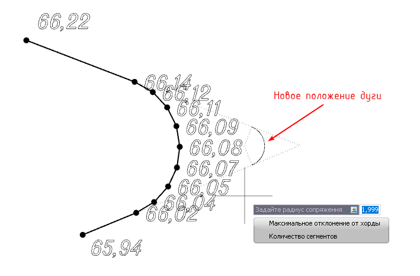

# Изменить дугу

Функция позволяет изменить такие параметры дугового сегмента, как радиус, максимальное отклонение от хорды и количество сегментов. Для этого:

1. Выберите элемент меню **Площадка – Структурные линии – Изменить дугу**. На экране появится графический курсор;

2. Укажите структурную линию, на которой находится дуга;

3. Выберите любую вершину, принадлежащую изменяемой дуге.

4. Курсор примет форму прицела, который привязан к центру создаваемой дуги. Задайте радиус в динамическом поле или определите его визуально, указав на экране.



 Дополнительные команды по вводу сопряжения находятся в меню выбора или в контекстном меню:

 * Команда **Максимальное отклонение от хорды** позволяет задать максимально возможное значение высоты сегментов дуги;
 * Командой **Количество сегментов** возможно задать необходимое число сегментов для разбиения дуги.

  .



В результате программа перестроит дугу по новым параметрам, проинтерполировав отметки точек между соседними вершинами.

