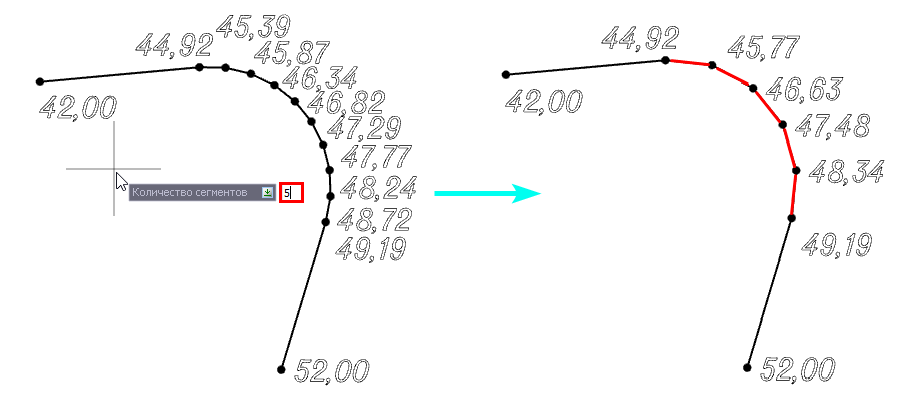

# Изменить количество сегментов дуги

Данная функция позволяет изменить количество сегментов дуги структурной линии. Для этого:

1. Выберите элемент меню **Площадка – Структурные линии – Изменить количество сегментов дуги**. На экране появится графический курсор.

2. Укажите структурную линию, на которой находится дуга.

3. Выберете любую точку дуги, у которой необходимо изменить количество сегментов.

4. В появившемся динамическом поле программа предложит указать новое количество сегментов. Также в меню выбора или в контекстном меню есть возможность задать параметр **Максимальное отклонение от хорды**.

5. Введите значение необходимого параметра и нажмите клавишу **Enter**.

В результате программа перестроит дугу по новым параметрам, проинтерполировав отметки точек между соседними вершинами.

