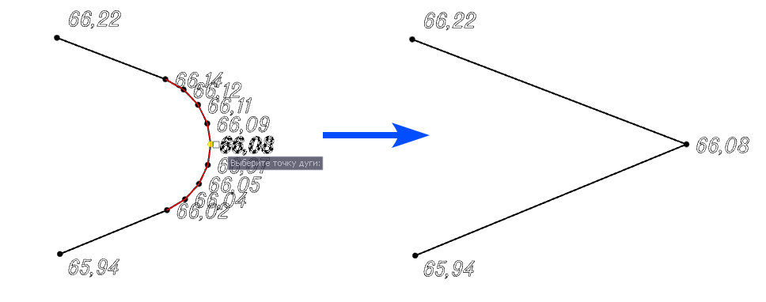

# Удалить дугу

Данная функция позволяет удалить предварительно созданный дуговой сегмент со структурной линии. Для этого:

1. Выберите элемент меню **Площадка – Структурные линии – Удалить дугу**. На экране появится графический курсор;

2. Укажите структурную линию, на которой находится дуга;

3. Выберите любую вершину, принадлежащую удаляемой дуге.

В результате программа удалит дуговой сегмент и по касательной восстановит положение вершины угла. Отметка вершины проинтерполируется между соседними вершинами:

