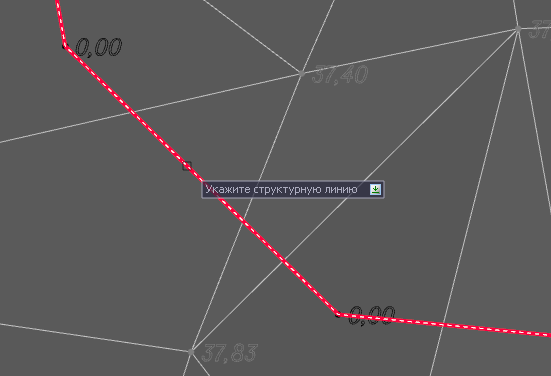
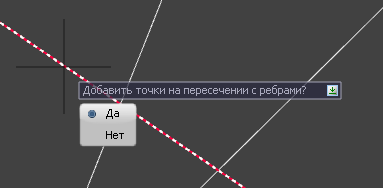
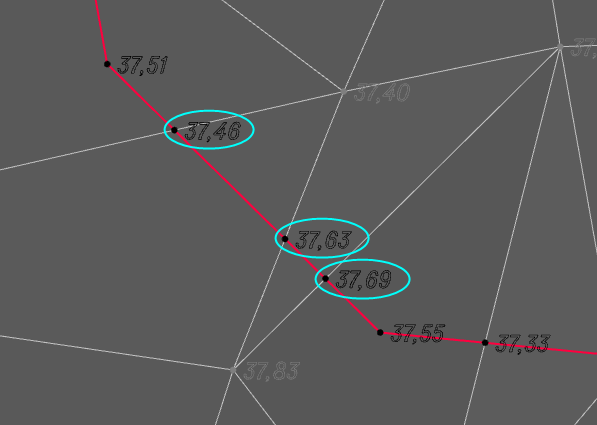

# Отметки по существующей

Данная функция позволяет задать значение отметки точкам выбранной структурной линии по *существующей поверхности*.



 В качестве *существующей поверхности* выступает модель, которая указана в [Настройках](../../creating_ground_model.md) модели **Площадка** на вкладке ЦММ.



Для этого:

1. Выберите меню **Площадки - Структурные линии – Отметки по существующей**;

2. В строке динамического ввода можно задать приращение отметки относительно существующей поверхности (земле);

3. Курсор примет форму прицела, укажите структурную линию:

4. Далее программа предложит дополнительно добавить точки на пересечении структурной линии с ребрами заданной существующей поверхности:

Таким образом, все точки структурной линии примут высотные отметки согласно заданной поверхности (земли) и значению приращения, дополнительно могут быть добавлены точки на пересечении структурной линии с ребрами поверхности.

