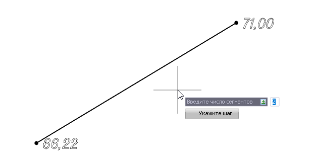
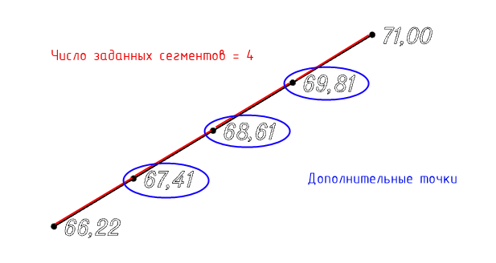

# Вставить дополнительные точки в сегмент структурной линии

Функция позволяет вставить дополнительные точки вдоль сегмента структурной линии исходя из заданного числа сегментов или шага расстановки точек.

Для этого:

1. Выберите элемент меню **Площадки – Структурные линии – Вставить дополнительные точки в сегмент структурной линии**.

2. На экране появится графический курсор. Введите **Число сегментов** в динамическом поле, на которое будет разбит исходный сегмент.



 Дополнительная команда **Укажите шаг** находится в меню выбора или в контекстном меню. Команда **Укажите шаг** позволяет задать числовое значение шага, с которым будут расставлены дополнительные точки в сегмент структурной линии.



2. Укажите сегмент структурной линии, вдоль которого необходимо вставить дополнительные точки.

В результате на сегмент структурной линии будут добавлены дополнительные точки, отметки которых интерполируются между вершинами сегмента структурной линии.

