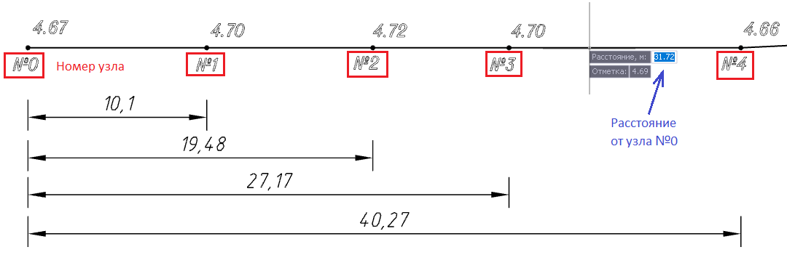

# Вставить узел вдоль структурной линии

Функция позволяет вставить дополнительную точку вдоль структурной линии на заданном расстоянии от ее начала.

Для этого:

1. Выберите элемент меню **Площадки – Структурные линии – Вставить узел вдоль структурной линии**. На экране появится графический курсор.

2. Укажите структурную линию, вдоль которой необходимо ввести узел.

3. Курсор примет форму прицела и будет перемещаться вдоль структурной линии. Для переключения между полями динамического вода **Отметки** и **Расстояния** используйте клавишу **TAB**:

* Определить положение нового узла можно визуально, указав на экране или ввести расстояние в поле динамического ввода. За начало отсчета расстояния принят нулевой узел структурной линии;
* По умолчанию отметка точки интерполируется между соседними вершинами. Самостоятельно отметку можно задать в поле динамического ввода.

В результате на структурную линию будет добавлена точка.



 Данная функция позволяет вставить точки только вдоль структурной линии. Для добавления узла вне траектории структурной линии воспользуйтесь функцией **[Вставить узел](../../../../ru/rb_survey/dtm/sfc/structure_lines/insert_nodes_in_structural_lines.md)**.



