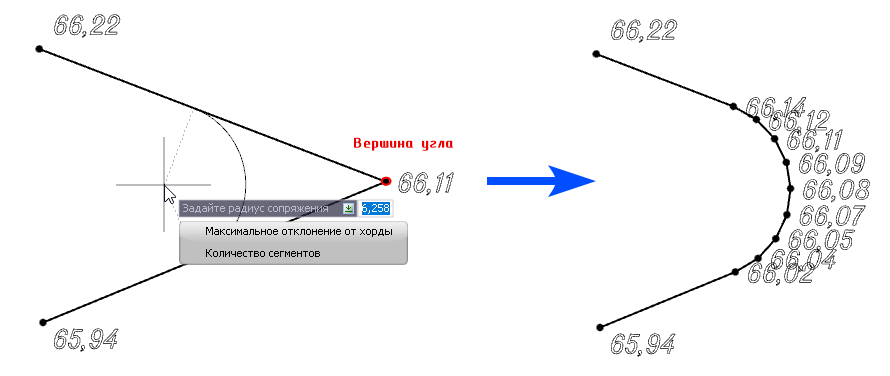
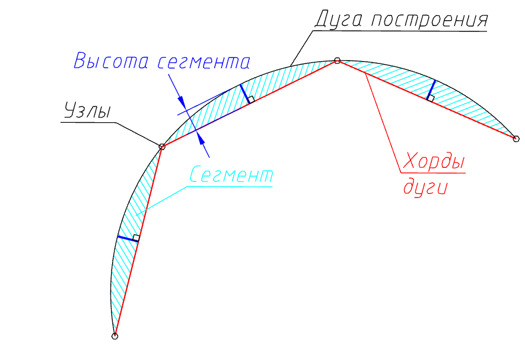

# Сопряжение сегментов

Функция позволяет построить дугу сопряжения в выбранной вершине структурной линии и задать ее параметры. Для этого:

1. Выберите элемент меню **Площадки – Структурные линии – Сопряжение сегментов**. На экране появится графический курсор.

2. Выберите точку сопряжения, т.е. вершину в которую программа впишет дугу.

3.Курсор примет форму прицела, который привязан к центру создаваемой дуги. Задайте радиус в динамическом поле или определите его визуально, указав на экране.



 Дополнительные команды по вводу сопряжения находятся в меню выбора или в контекстном меню:

 * Команда **Максимальная отклонение от хорды** позволяет задать максимально возможное значение высоты сегментов дуги;
 * Командой **Количество сегментов** возможно задать необходимое число сегментов для разбиения дуги.

 



В результате на месте выбранной вершины будет построена дуга сопряжения, отметки точек которой будут проинтерполированы между соседними вершинами.

