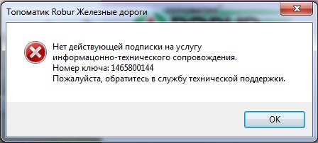
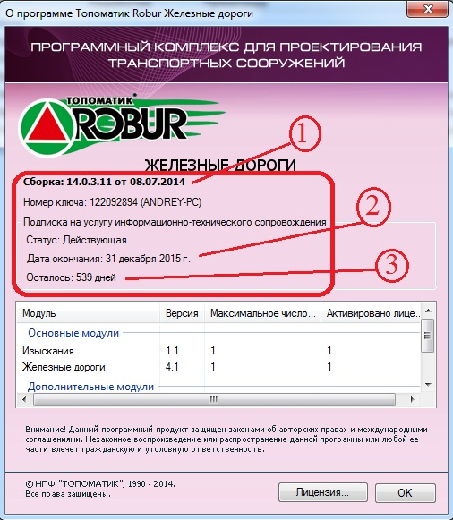
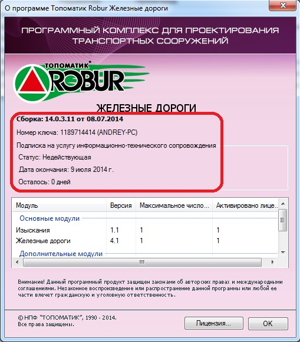
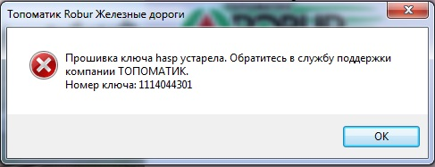
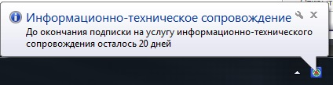
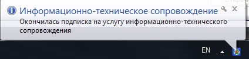

# О подписке

Подписка на услугу информационно-технического сопровождения (далее – Подписка) позволяет зарегистрированному пользователю программного обеспечения {{topomatic-name}} (далее – ПО), в течение оговоренного периода времени, получать обновления ПО и консультации по вопросам его использования.



## Для чего нужна Подписка

ПО, разрабатываемое {{topomatic-name}}, является высокотехнологичной, наукоемкой программной продукцией, в которой реализованы сложные оптимизационные методы и алгоритмы по работе с пространственной геометрией, а также учтены требования многочисленных нормативных документов. Для эффективной работы с ПО от проектировщика требуется не только знания в предметной области, но и устойчивые практические навыки пользования конкретным программным продуктом. Исчерпывающие методические пособия и документация по работе с ПО занимают объем более 2000 страниц печатного текста, что требует от проектировщика определенных затрат времени для решения конкретного вопроса.

Служба технической поддержки {{topomatic-name}} позволяет в максимально сжатые сроки, оперативно решить проблемы и дает возможность проектировщику сосредоточиться на выполнение инженерных задач.

{{topomatic-name}} постоянно совершенствует всю линейку своих программных продуктов. Каждая новая версия, помимо исправления возможных ошибок, содержит целый ряд усовершенствований, сделанных по разумным предложениям пользователей. Работа на самой новой версии позволяет проектировщику избежать многих известных проблем.

{{topomatic-name}} предоставляет обновления и консультирует зарегистрированных пользователей своих программных продуктов **только при наличии действующей подписки на услугу информационно-технического сопровождения**.





## Где хранится информация о Подписке

Информация о подписке хранится одновременно в двух местах:

* В базе данных на сервере {{topomatic-name}}.
* У пользователя, на ключе HASP аппаратной защиты ПО.

Информацией о Подписке содержит следующие данные:

* Период времени действия Подписки.
* Уникальный номер ключа аппаратной защиты.
* Прошитые на данном ключе лицензии на ПО.





## Как это работает

Исполняемый модуль ПО содержит номер сборки и дату выпуска. При запуске, ПО сравнивает дату своего выпуска и дату окончания подписки. Таким образом, проверяется наличие у пользователя действующей подписки для данной сборки.

Если дата выпуска **ПО МЕНЬШЕ** даты окончания Подписки (то есть, Подписка действующая для данной сборки), то ПО продолжает работу.

Если дата выпуска **ПО БОЛЬШЕ** даты окончания Подписки (то есть, Подписка недействующая), то ПО выдает следующее сообщение и завершает работу.

Таким образом, пользователь может устанавливать обновления ПО (новые сборки) только в течение периода времени действия Подписки.

В процессе проверки не используются системные дата и время, выставленные на компьютере, так как сравниваются значения, хранящиеся в исполняемом модуля ПО и ключе аппаратной защиты. Переустановка системной даты не влияет на данную проверку.





## Как проверить Подписку

Для того, чтобы проверить Подписку запустите ПО и выберите элемент меню `Справка` → `О программе`. Откроется диалоговое окно:

1. Номер и дата сборки читаются из исполняемого модуля ПО.
2. Дата окончания подписки читается из ключа аппаратной защиты.
3. Количество дней, оставшееся до окончания подписки, рассчитывается с использованием текущей системной даты, выставленной на компьютере.

Если количество дней меньше нуля, то диалоговое окно выглядит следующим образом:

Статус и количество оставшихся дней являются только информационными полями. Они зависят от системной даты. Поэтому, чтобы эти поля отображали актуальную информацию, системная дата на компьютере должна быть установлена правильно.

Если ПО при запуске выдает следующее сообщение:

это означает, что на ключе отсутствует информация о Подписке. Для продолжения работы прошивку ключа необходимо обновить.

ПО периодически контролирует состояние Подписки. Если до окончания Подписки остается менее 30 дней, то при каждом запуске ПО выдает предупреждение:

Если подписка закончилась, то информационное сообщение выглядит следующим образом:

Если вы получили такое сообщение, то:

1. Вы можете продолжать использовать установленную сборку ПО как угодно долго, без каких-либо ограничений.
2. Вы не можете устанавливать обновления ПО.
3. Вы не можете пользовать услугой технической поддержки {{topomatic-name}}.





## Как продлить Подписку

Для продления Подписки необходима перепрошивка ключа аппаратной защиты. Для этого, пожалуйста, обратитесь в службу технической поддержки {{topomatic-name}} и вам будут предоставлены подробные инструкции.


