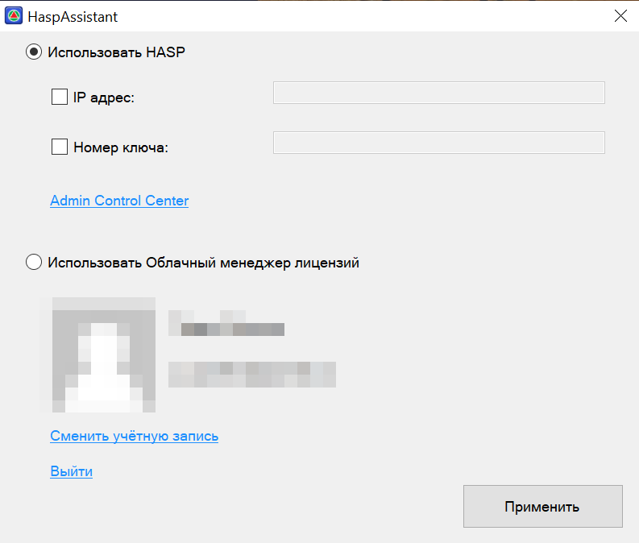
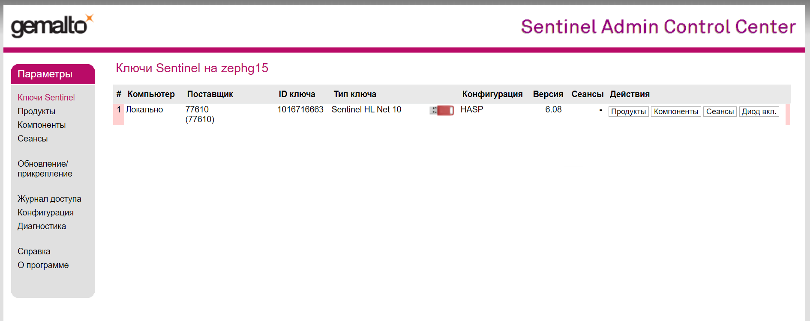
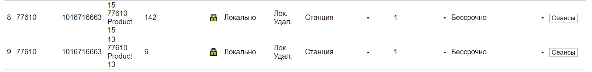
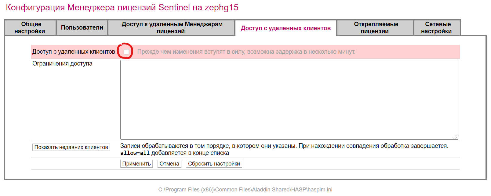
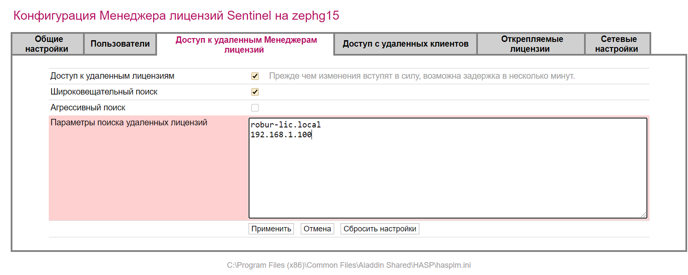

# Защита

Лицензии для ПК «{{robur}}» работают с использованием ключей аппаратной защиты на базе технологии Sentinel HASP (Gemalto).



## Утилита HaspAssistant.exe

C помощью утилиты HaspAssistant (расположенной в папке установки {{robur}} (например `C:\Program Files\Topomatic Robur Road 16.0`)) можно указывать № ключа защиты при использовании нескольких ключей на одном хосте и назначать адрес сервера лицензирования.

(для использования утилиты необходимы права на запись в папку установки).





## Sentinel HASP

При подключении ключа защиты непосредственно в рабочую станцию (ноутбук), если драйвера и менеджер лицензий были установлены успешно:

* По адресу [localhost:1947](http://localhost:1947/ru.14.2.alp/devices.html) должен быть виден ключ:

  

* В разделе «Компоненты» (Features) должны быть перечислены коды лицензий продуктов:

  

При при работе с локальным ключом защиты рекомендуем отключать опцию [«доступ с удалённых клиентов»](http://localhost:1947/ru.14.2.alp/config_from.html):

При работе с корпоративным сервером лицензий:

* Адрес сервера указывается в «Менеджере лицензий Sentinel» [Доступ к удалённым Менеджерам лицензий](http://localhost:1947/ru.14.2.alp/config_to.html):

  

Подробнее [см. раздел Установка](installation.md).


